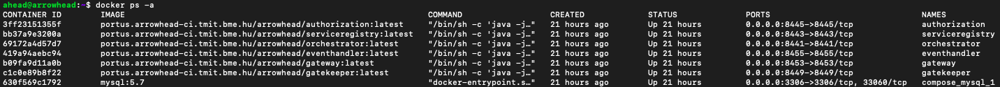
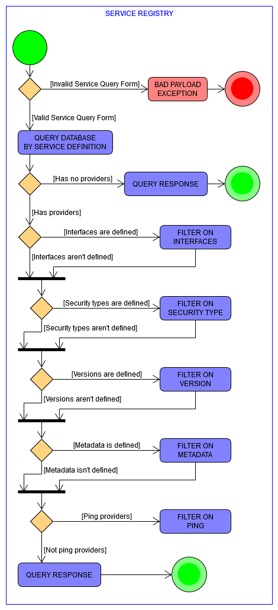
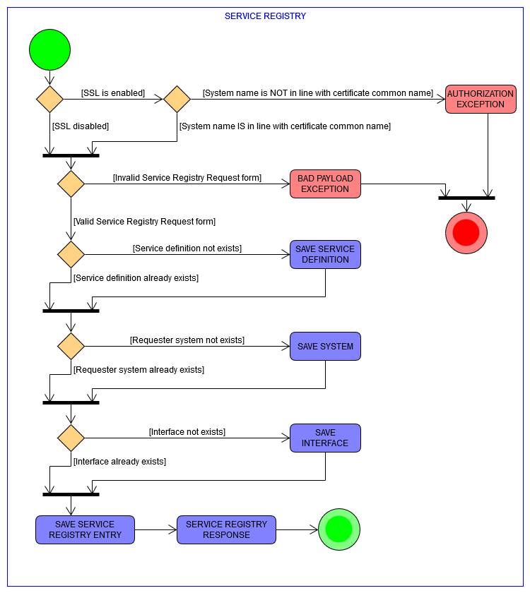
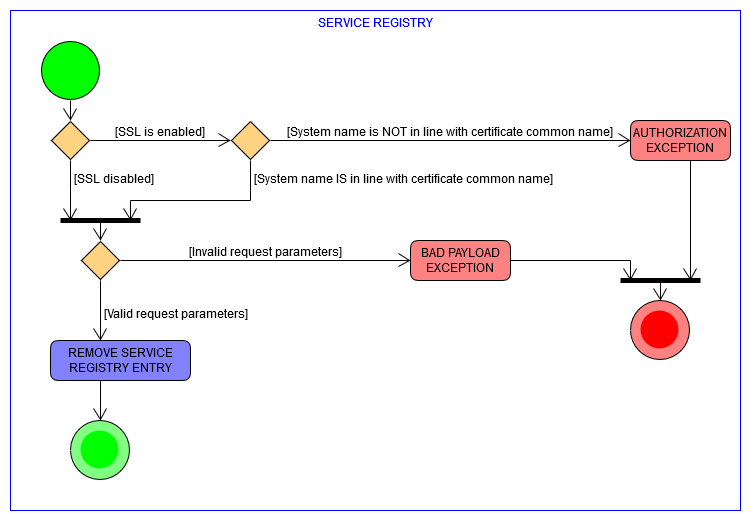
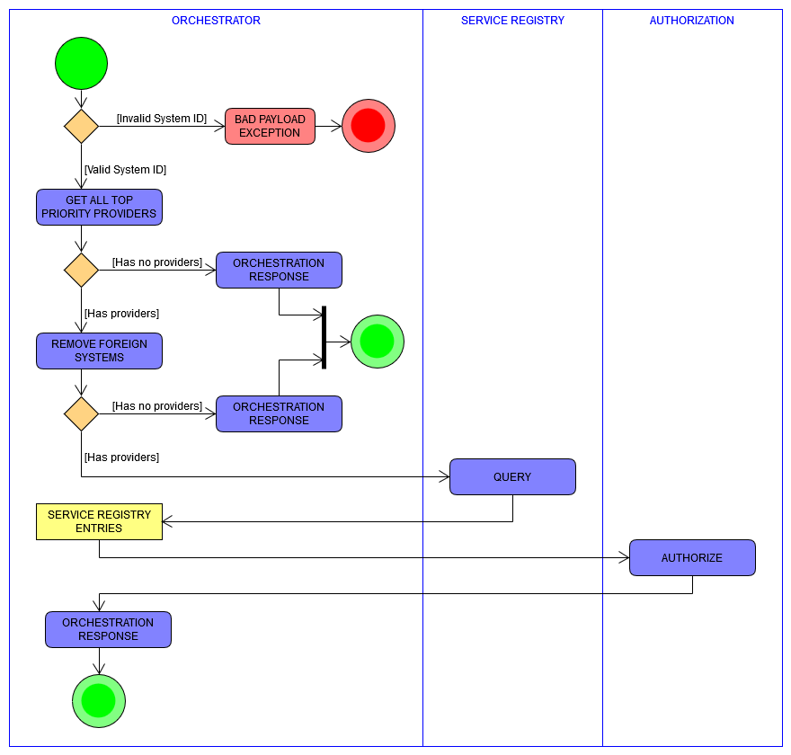
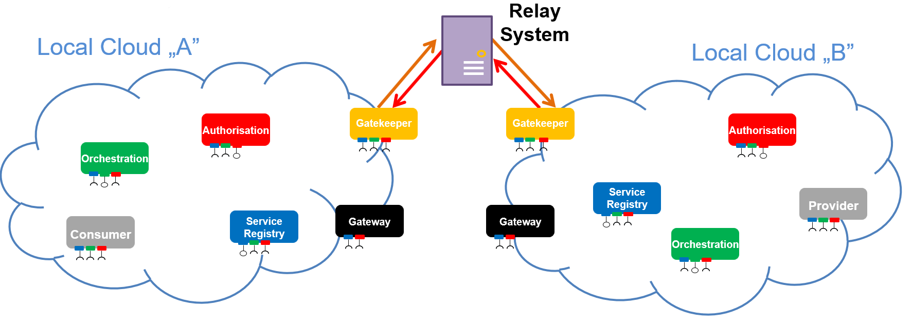
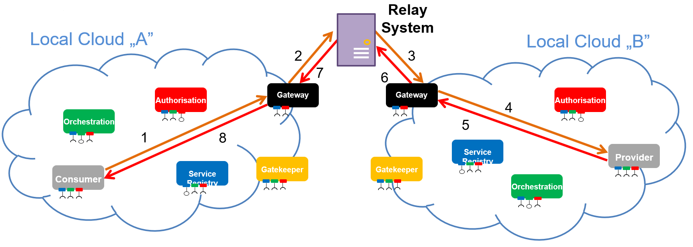

# Arrowhead Framework 4.1.3

[Arrowhead](http://www.arrowhead.eu/) (and its continuation, [Productive4.0](https://productive40.eu/)) is an ambitious holistic innovation project,
 meant to open the doors to the potentials of Digital Industry and to maintain a leadership position of the industries in Europe. All partners involved will work on creating the capability to efficiently design and integrate hardware and software of Internet of Things (IoT) devices. Linking the real with the digital world takes more than just adding software to the hardware.
 

## Disclaimer
Please be aware, that 4.1.3 is __NOT__ backwards compatible with 4.1.2. If you have older systems please refer to the [Migration Guide](#migration) 
 
## Table of Contents
1. [Quick Start Guide](#quickstart)
    1. [Docker](#quickstart_docker)
        * [Handy Docker Commands](#quickstart_dockercommands)
        * [Troubleshooting](#quickstart_dockertroubleshooting)
	2. [Debian Installer](#quickstart_debian)
    3. [Compile Code](#quickstart_compile)
2. [Migration Guide 4.1.2 -> 4.1.3](#migration)
3. [Certificates](#certificates)
4. [Gatekeeper and Gateway Setup with ActiveMQ Relay](#setupgatekeeper_and_gateway)
5. [How to Contribute](#howtocontribute)
6. [Documentation](#documentation) 
    1. [Service Registry](#serviceregistry)
       * [System Design Description Overview](#serviceregistry_sdd)
       * [Services and Use Cases](#serviceregistry_usecases)
       * [Security](#serviceregistry_security)
       * [Endpoints](#serviceregistry_endpoints)
           * [Client](#serviceregistry_endpoints_client)
           * [Private](#serviceregistry_endpoints_private)
           * [Management](#serviceregistry_endpoints_mgmt) 
           * [Removed Endpoints](#serviceregistry_removed)
    2. [Authorization](#authorization)
       * [System Design Description Overview](#authorization_sdd)
       * [Services and Use Cases](#authorization_usecases)
       * [Service Description Overview](#authorization_service_description_overview)
       * [Endpoints](#authorization_endpoints)
            * [Client](#authorization_endpoints_client)
            * [Private](#authorization_endpoints_private)
            * [Management](#authorization_endpoints_mgmt) 
            * [Removed Endpoints](#authorization_removed)
    3. [Orchestrator](#orchestrator)
       * [System Design Description Overview](#orchestrator_sdd)
       * [Services and Use Cases](#orchestrator_usecases)  
       * [Endpoints](#orchestrator_endpoints)
           * [Client](#orchestrator_endpoints_client)
           * [Private](#orchestrator_endpoints_private)
           * [Management](#orchestrator_endpoints_management)     
           * [Removed Endpoints](#orchestrator_removed)
    4. [EventHandler](#event_handler)
       * [System Design Description Overview](#event_handler_sdd)
       * [Services and Use Cases](#event_handler_usecases)  
       * [Service Description Overview](#publish_service_description_overview)
           * [Publish](#publish_service_description_overview)
	   * [Subcribe](#subscribe_service_description_overview)
	   * [Unsubscribe](#unsubscribe_service_description_overview)
	   * [PublishAuthUpdate](#publish_auth_update_service_description_overview)
       * [Endpoints](#event_handler_endpoints)
           * [Client](#event_handler_endpoints_client)
           * [Private](#event_handler_endpoints_private)
           * [Management](#event_handler_endpoints_management)
           * [Removed Endpoints](#event_handler_removed)
    5. [Gatekeeper](#gatekeeper)
       * [System Design Description Overview](#gatekeeper_sdd)
       * [Services and Use Cases](#gatekeeper_usecases)  
       * [Endpoints](#gatekeeper_endpoints)
		   * [Client](#gatekeeper_endpoints_client)
           * [Private](#gatekeeper_endpoints_private)
           * [Management](#gatekeeper_endpoints_mgmt)     
           * [Removed Endpoints](#gatekeeper_removed)
    6. [Gateway](#gateway)
       * [System Design Description Overview](#gateway_sdd)
       * [Services and Use Cases](#gateway_usecases)  
       * [Endpoints](#gateway_endpoints)
	       * [Client](#gateway_endpoints_client)
           * [Private](#gateway_endpoints_private)
           * [Management](#gateway_endpoints_mgmt)
	
<a name="quickstart" />

## Quick Start Guide

<a name="quickstart_docker" />

### Docker

#### Requirements

> **Note:** A system with 4GB of RAM is advised. 

* Docker 
  * [Ubuntu](https://docs.docker.com/install/linux/docker-ce/ubuntu/)
  * [Debian](https://docs.docker.com/install/linux/docker-ce/debian/)
  * [Mac OS](https://docs.docker.com/docker-for-mac/install/) - Helpful tool for container management: [Kitematic](https://kitematic.com/)
  * [Windows](https://docs.docker.com/docker-for-windows/install/)
* [Docker Compose](https://docs.docker.com/compose/install/)

Don't forget to create a volume for mysql: `docker volume create --name=mysql` <br />
Don't forget to copy the `initSQL.sh` script next to the docker-compose file and execute it! On the first run it initializes the Database!<br />
Example copy command which does this for you, execute from the project root directory.
```
cp scripts/initSQL.sh docker/
cd docker
./initSQL.sh
```

Inside the `docker` folder an example is provided. 

##### Core System Config

Example Core System Configuration files are available in this folder. 

> **Note:** Don't forget to set `domain.name` and `domain.port` properties!

##### Docker Compose

Example Docker Compose file is located here. The interesting part is the volumes section. 
Format is /path/on/your/local/machine:/path/inside/docker/container

You may want to copy the config files elsewhere with the compose file too. If you copy them, please don't forget to change the volume mounting point, but DON'T change the volume mounting point inside the container, otherwise it will start up with default config.

To update the images: execute `docker-compose pull` command in the directory where the compose file is.

To start the containers: execute `docker-compose up -d` command in the directory where the compose file is.

Don't forget to check, are all containers up and running?



If all of their is Up, you are all set.
If they die, please check their logs. 

If you change your config you have to restart the appropriate container

`docker restart <containerName>`

<a name="quickstart_dockercommands" />`

##### Handy Docker Commands
 
| Command | Description |
| ------- | ----------- |
| `docker ps -a` | List all containers |
| `docker images` | List all images |
| `docker-compose up -d` | Starts the Docker containers |
| `docker-compose down` | Destroys the Docker containers |
| `docker logs <containerName>` | Shows logs for the container |
| `docker volume create --name=<volumeName>` | Creates a named volume |
| `docker volume rm <volumeName>` | Removes the specified named volume |

<a name="quickstart_dockertroubleshooting" />

##### Troubleshooting

Q: MySQL won't start. What did went wrong? <br />
A: Probably you missed to copy the init SQL script next to the compose file, or you have a typo in its name. Solution: [https://github.com/arrowhead-f/core-java-spring/issues/105](https://github.com/arrowhead-f/core-java-spring/issues/105)


<a name="quickstart_debian" />

### Debian Installers

The Debian installer files are located in the deb-installer/package/arrowhead-installers-4.1.3 folder. 
Please follow this guide to install them: [Debian Installer Guide](documentation/deb-installer/DEBIAN-INSTALL.md)

> **Note:** Preferred installation mode for Raspberry Pi.

<a name="quickstart_compile" />

### Compile source code and manually install MySQL and Maven.
#### Requirements

> **Note:** A system with 2GB of RAM is advised. 

The project has the following dependencies:
* JRE/JDK 11 [Download from here](https://www.oracle.com/technetwork/java/javase/downloads/jdk11-downloads-5066655.html)
* Maven 3.5+ [Download from here](http://maven.apache.org/download.cgi) | [Install guide](https://www.baeldung.com/install-maven-on-windows-linux-mac)
* MySQL server 5.7+ (other SQL databases can work with Hibernate ORM, but the `common module pom.xml` has to include the appropriate connector 
dependency to use them)

Verify that you have Java (```java -version```), Maven (```mvn -version```), MySQL installed properly!

Pull this code and enter the directory. 
```git clone https://github.com/arrowhead-f/core-java-spring.git```

Got to the ```scripts``` folder, execute ```mysql -u root -p < create_empty_arrowhead_db.sql``` MySQL script. If you won't run this script first, the project won't build. 

```cd core-java-spring```

Execute ```mvn install -DskipTests ``` command. Wait until the build succeeds. 
This command builds all available projects. <br />

After the build is complete, the jars with the appropriate `application.properites` will be available in their directory.

#### Starting the core systems manually:

Change directory to:

- serviceregistry/target directory.
```cd serviceregistry/target``` <br />and execute: ```java -jar arrowhead-serviceregistry-4.1.3.jar```
- authorization/target directory. ```cd authorization/target``` <br />and execute: ```java -jar arrowhead-authorization-4.1.3.jar``` 
- orchestrator/target directory. ```orchestrator/target``` <br />and execute: ```java -jar arrowhead-orchestrator-4.1.3.jar```

#### Starting the core system automatically:

After successful build enter the scripts folder and execute ```start_core_systems.sh``` or ```start_core_systems.bat``` depending on your operating system.


Wait until servers start...

> **Note:** By default servers start in SECURE mode. To access them, you need to use an example certificate, provided in the `certificate` directory.

> **Note:** If you wish to change the the configuration, do it by by modifying the `application.properties` file in the `target` directory! Don't forget to change all of them!

Service Registry will be available on ```https://localhost:8443``` <br />
Authorization will be available on ```https://localhost:8445``` <br />
Orchestrator will be available on ```https://localhost:8441``` <br />
Event Handler will be available on ```https://localhost:8455``` <br />
Gatekeeper will be available on ```https://localhost:8449``` <br />
Gateway will be available on ```https://localhost:8453``` <br />

Swagger with API documentation is available in the root route.

#### Insecure Mode - (not recommended)

To start in insecure mode, you have to change the __server.ssl.enabled__ property to false. You'll have to do it for each core system, under the path target/application.properties. Note that if you recompile after the changes, the target/application.properties file will be overwritten by the default ones in the src/main/resources/application.properties.

The Gatekeeper and Gateway use encryption based on the certificates, hence there is no way to start the Gatekeeper and Gateway in insecure mode. But you can use the local cloud without these core systems. All you have to do is to set __gatekeeper\_is\_present=false__ in the application.properties of the ochestrator, and start the script __start\_coresystems\_local.bat__ or __start\_coresystems_local.sh__ depending on your operating system.


<a name="migration" />

## Migration Guide 4.1.2 -> 4.1.3

4.1.3 is NOT backwards compatible with 4.1.2! Earlier it was redundant and contained gaps. Now the database and the endpoints are redesigned, they are clean, more logical and easier to use.

You can migrate your existing database manually. See the [Quick Start Guide](#quickstart), how to deploy the Core Systems.

Major endpoint changes:<br />

### Service Registry Core System:

The following endpoints no longer exist, instead use the ones on the right:

 * `PUT /mgmt/services` -> `POST /serviceregistry/mgmt/services`
 * `PUT /mgmt/systems` -> `POST /serviceregistry/mgmt/systems`
 * `GET /serviceregistry/mgmt/systemId/{systemId}` -> `GET /serviceregistry/mgmt/systems/{id}`
 * `GET /serviceregistry/mgmt/serviceId/{serviceId}/providers`
 * `PUT /serviceregistry/mgmt/query` -> `POST /serviceregistry/query`
 * `PUT /serviceregistry/mgmt/subscriptions/{id}`
 * `PUT /serviceregistry/support/remove` -> `DELETE /serviceregistry/unregister`
 * `DELETE /serviceregistry/mgmt/all`
 
 
 * __serviceregistry/register__ - data structure changed
 
Description for this endpoint is available here: [Register](#serviceregistry_endpoints_post_register)
 
Old payload, which is no longer usable
 ```json
{
  "providedService" : {
    "serviceDefinition" : "IndoorTemperature",
    "interfaces" : [ "JSON", "XML" ],
    "serviceMetadata" : {
      "unit" : "celsius"
    }
  },
  "provider" : {
    "systemName" : "InsecureTemperatureSensor",
    "address" : "192.168.0.2",
    "port" : 8080
  },
  "serviceURI" : "temperature",
  "version" : 1,
  "udp" : false,
  "ttl" : 0
} 
 ```

New payload - you can easily map the old fields to the new ones.

 ```json
{
  "serviceDefinition": "IndoorTemperature",
  "providerSystem": {
    "systemName": "InsecureTemperatureSensor",
    "address": "192.168.0.2",
    "port": 8080,
  "authenticationInfo": "eyJhbGciOiJIUzI1Ni..."
 },
  "serviceUri": "temperature",
  "endOfValidity": "2019-12-05T12:00:00",
  "secure": "TOKEN",
  "metadata": {
    "unit": "celsius"
 },
  "version": 1,
  "interfaces": [
    "HTTP-SECURE-JSON"
  ]
}
```
 
### Authorization Core System:
 * __/mgmt/intracloud__ - data structure changed
 * __/mgmt/intercloud__ - data structure changed
 
 How to [Add Intracloud rules](#authorization_endpoints_post_intracloud) <br />
 How to [Add Intercloud rules](#authorization_endpoints_post_intercloud)
 
### Orchestration Core System:
 * __/mgmt/store__ - data structure changed
 * __/orchestrator/orchestration__ - data structure changed
 
 Description for this endpoint is available here: [Orchestration](#orchestrator_endpoints_post_orchestration)
 
 Old payload, which is no longer usable
 
 ```json
{
  "requesterSystem" : {
    "systemName" : "client1",
    "address" : "localhost",
    "port" : 0,
    "authenticationInfo" : "null"
  },
  "requestedService" : {
    "serviceDefinition" : "IndoorTemperature",
    "interfaces" : [ "json" ],
    "serviceMetadata" : {
      "unit" : "celsius"
    }
  },
  "orchestrationFlags" : {
    "onlyPreferred" : false,
    "overrideStore" : true,
    "externalServiceRequest" : false,
    "enableInterCloud" : true,
    "enableQoS" : false,
    "matchmaking" : false,
    "metadataSearch" : true,
    "triggerInterCloud" : false,
    "pingProviders" : false
  },
  "preferredProviders" : [ ],
  "requestedQoS" : { },
  "commands" : { }
}
```

New payload - you can easily map the old fields to the new ones.

```json
{
  "requesterSystem": {
    "systemName": "string",
    "address": "string",
    "port": 0,
    "authenticationInfo": "string"
  },
  "requestedService": {
    "serviceDefinitionRequirement": "string",
    "interfaceRequirements": [
      "string"
    ],
    "securityRequirements": [
      "NOT_SECURE", "CERTIFICATE", "TOKEN"
    ],
    "metadataRequirements": {
      "additionalProp1": "string",
      "additionalProp2": "string",
      "additionalProp3": "string"
    },
    "versionRequirement": 0,
    "maxVersionRequirement": 0,
   "minVersionRequirement": 0
  },
  "preferredProviders": [
    {
      "providerCloud": {
        "operator": "string",
        "name": "string"
      },
      "providerSystem": {
        "systemName": "string",
        "address": "string",
        "port": 0
      }
    }
  ],
  "orchestrationFlags": {
    "additionalProp1": true,
    "additionalProp2": true,
    "additionalProp3": true
  }
}
```

<a name="certificates" />

## Certificates

Arrowhead Framework's security is relying on SSL Certificate Trust Chains. The Arrowhead trust chain consists of three level:
1) Master certificate: `arrowhead.eu`
2) Cloud certificate: `my_cloud.my_company.arrowhead.eu`
3) Client certificate: `my_client.my_cloud.my_company.arrowhead.eu`
The certificate naming convetion have strict rules:
* The different parts are delimited by dots, therefore parts are not allowed to contain any of them.
* A cloud certificate name has to consist of four part and the last two part have to be 'arrowhead' and 'eu'.
* A client certificate name has to consist of five part and the last two part have to be 'arrowhead' and 'eu'. 

The trust chain is created by issuing the cloud certificate from the master certificate and the client certificate from the cloud certificate. With other words, the **cloud certificate is signed by the master certificate's private key** and the **client certificate is signed by the cloud certificate's private key** which makes the whole chain trustworthy.

### The Key-Store

The Key-Store is intended to store the certificates and/or key-pair certificates. Key-pair certificates are contain the certificate chain with some additinal data, such as the private-public keys, which are necessary for the secure operation. Certificates located in this store (without the keys) will be attached to the outcoming HTTPS requests. Arrowhead Framework is designed for handling the `p12` type of Key-Stores.

*(**Note:** When you creating a new key-pair certificate, then the `key-password` and the `key-store-password` must be the same.)*

### The Trust-Store

The Trust-Store is containing those certificates, what the web-server considers as trusted ones. Arrowhead Framework is designed for handling the `p12` type of Trust-Stores. Typically your Trust-Store should contain only the cloud certificate, which ensures that only those incoming HTTPS requests are authorized to access, which are having this certificate within their certificate chain.

### How to create my own certificates?
Currently Arrowhead community have the possibility to create only "self signed" certifications. See the tutorials:
* [Create Arrowhead Cloud Self Signed Certificate](documentation/certificates/create_cloud_certificate.pdf)
* [Create Arrowhead Client Self Signed Certificate](documentation/certificates/create_client_certificate.pdf)
* [Create Trust Store](documentation/certificates/create_trust_store.pdf)

### System Operator Certificate

The System Operator Certificate is a special client certificate with the naming convention of `sysop.my_cloud.my_company.arrowhead.eu`.
SysOp certificate allows the client to use the management endpoints of the Arrowhed Core Systems. Typical usage of SysOp certificate is by front end applications running in a web browser.
* [Import SysOp Certificate (Windows 10)](https://github.com/arrowhead-f/core-java-spring/blob/documentation/documentation/certificates/import_sysop_certificate_win10.pdf)

<a name="setupgatekeeper_and_gateway" /> 

## Gatekeeper and Gateway Setup with ActiveMQ Relay

Please follow this guide to setup the Arrowhead Gatekeeper and Gateway core systems: [Gatekeeper & Gateway Setup Guide with ActiveMQ Relay](documentation/gatekeeper/GatekeeperSetup.md)

<a name="howtocontribute" />

## How to Contribute

### Open Development

All work on Arrowhead repositories happens directly on GitHub. Both core team members and external contributors send pull requests which go through the same review process.

### Branch Organization

The latest version of the core systems are available in the ```master``` branch. The code for the next release is merged in the ```development``` branch. If you would like to contribute, please check out the ```development``` branch. Create a new branch from ```development```. Don't forget do write documentation, unit and integration tests. When finished, create a pull request back into ```development```. If accepted, your contribution will be in the next release. :)

### Bugs

#### Where To Find Known Issues
We are using [GitHub Issues](https://github.com/arrowhead-f/core-java-spring/issues) for our public bugs. We keep a close eye on this and try to make it clear when we have an internal fix in progress. Before filing a new task, try to make sure your problem doesn’t already exist.

#### Reporting New Issues
The best way to get your bug fixed is to provide a reduced test case.

#### How to Get in Touch
Join our developer team on Slack. Write an email to [szvetlin@aitia.ai](mailto:szvetlin@aitia.ai) for an invite. 

<a name="documentation" />

# Documentation 
 
<a name="serviceregistry" />
 
# Service Registry 
 
<a name="serviceregistry_sdd" />
 
## System Design Description Overview

This System provides the database, which stores information related to the currently actively offered Services within the Local Cloud.

The purpose of this System is therefore to allow:
-	Application Systems to register what Services they offer at the moment, making this announcement available to other Application Systems on the network. 
-	They are also allowed to remove or update their entries when it is necessary. 
-	All Application Systems can utilize the lookup functionality of the Registry to find Public Core System Service offerings in the network, otherwise the Orchestrator has to be used. 

However, it is worth noting, that within this generation the lookup functionality of Services is integrated within the “orchestration process”. Therefore, in the primary scenario, when an Application System is looking for a Service to consume, it shall ask the Orchestrator System via the Orchestration Service to locate one or more suitable Service Providers and help establish the connection based on metadata submitted in the request. Direct lookups from Application Systems within the network is not advised in this generation, due to security reasons.

However, the lookup of other Application Systems and Services directly is not within the primary use, since access will not be given without the Authorization JWT (JSON Web Token). The use of the TokenGeneration is restricted to the Orchestrator for general System accountability reasons. 

<a name="serviceregistry_usecases" />

## Services and Use Cases

This System only provides one Core Service the __Service Discovery__

There are two use case scenarios connected to the Service Registry. 
-	Service registration, de-registration
-	Service Registry querying (lookup)

The __register__ method is used to register services. The services will contain various metadata as well as a physical endpoint. 
The various parameters are representing the endpoint information that should be registered.

The __unregister__ method is used to unregister service instances that were previously registered in the Registry. 
The instance parameter is representing the endpoint information that should be removed.

The __query__ method is used to find and translate a symbolic service name into a physical endpoint, for example an IP address and a port.
The query parameter is used to request a subset of all the registered services fulfilling the demand of the user of the service.
The returned listing contains service endpoints that have been fulfilling the query.


There is another functionality that does not bound to any Services, just an internal part of the Service Registry. There are two optional cleanup tasks within the Service Registry, which can be used to remove old, inactive service offerings. The first task is based on pinging the service provider and if the provider does not respond to the ping, its offered services will be deleted. The second task is based on a feature, called “Time to Live”. Service providers upon registration can provide a timestamp called “end_of_validity” number, which specifies how long the service will be offered by the provider, making the service de-registrations unnecessary, if this task is active. The task is used to remove expired services. The third task is using a feature called "Heartbeat" (Not yet implemented), where the Service provider periodically signals to the Service Registry that it is still alive. When it misses it will be removed. All of these internal tasks can be configured in the application.properties file.

<a name="serviceregistry_security" />

## Security

This System can be secured via the HTTPS protocol. If it is started in secure mode, it verifies whether the Application System possesses a proper X.509 identity certificate and whether that certificate is Arrowhead compliant in its making. This certificate structure and creation guidelines ensure:
-	Application System is properly bootstrapped into the Local Cloud
-	The Application System indeed belongs to this Local Cloud
-	The Application System then automatically has the right to register its Services in the Registry.

If these criteria are met, the Application System’s registration or removal message is processed. An Application System can only delete or alter entries that contain the Application System as the Service Provider in the entry. 

<a name="serviceregistry_endpoints" />

## Endpoints

The Service Registry offers three types of endpoints. Client, Management and Private.

Swagger API documentation is available on: `https://<host>:<port>` <br />
The base URL for the requests: `http://<host>:<port>/serviceregistry`

<a name="serviceregistry_endpoints_client" />

### Client endpoint description<br />

| Function | URL subpath | Method | Input | Output |
| -------- | ----------- | ------ | ----- | ------ |
| [Echo](#serviceregistry_endpoints_get_echo)     | /echo       | GET    | -     | OK     |
| [Query](#serviceregistry_endpoints_post_query)    | /query      | POST   | [ServiceQueryForm](#datastructures_servicequeryform) | [ServiceQueryList](#datastructures_servicequerylist) |
| [Register](#serviceregistry_endpoints_post_register) | /register   | POST   | [ServiceRegistryEntry](#datastructures_serviceregistryentry) | [ServiceRegistryEntry](#datastructures_serviceregistryentry) |
| [Unregister](#serviceregistry_delete_unregister) | /unregister | DELETE | Address, Port, Service Definition, System Name in query parameters| OK |

<a name="serviceregistry_endpoints_private" />

### Private endpoint description<br />

These services can only be used by other core services, therefore they are not part of the public API.

| Function | URL subpath | Method | Input | Output |
| -------- | ----------- | ------ | ----- | ------ |
| [Query System](#serviceregistry_endpoints_post_query_system) | /query/system| POST | System | System |
| [Query System By ID](#serviceregistry_endpoints_get_query_system_id) | /query/system/{id} | GET | ID | System|

<a name="serviceregistry_endpoints_mgmt" />

### Management endpoint description<br />

There endpoints are mainly used by the Management Tool and Cloud Administrators.

| Function | URL subpath | Method | Input | Output |
| -------- | ----------- | ------ | ----- | ------ |
| [Get all entries](#serviceregistry_endpoints_get_mgmt) | /mgmt/ | GET | - | [ServiceRegistryEntryList](#datastructures_serviceregistryentrylist) |
| [Add an entry](#serviceregistry_endpoints_post_mgmt) | /mgmt/ | POST | [ServiceRegistryEntry](#datastructures_serviceregistryentry) | [ServiceRegistryEntry](#datastructures_serviceregistry_entry) |
| [Get an entry by ID](#serviceregistry_endpoints_get_mgmt) | /mgmt/{id} | GET | ServiceID | [ServiceRegistryEntry](#datastructures_serviceregistryentry) |
| [Replace an entry by ID](#serviceregistry_endpoints_put_mgmt) | /mgmt/{id} | PUT | [ServiceRegistryEntry](#datastructures_serviceregistryentry) | [ServiceRegistryEntry](#datastructures_serviceregistryentry) |
| [Modify an entry by ID](#serviceregistry_endpoints_patch_mgmt) | /mgmt/{id} | PATCH | Key value pairs of [ServiceRegistryEntry](#datastructures_serviceregistryentry) | [ServiceRegistryEntry](#datastructures_serviceregistryentry) |
| [Delete and entry by ID](serviceregistry_endpoints_delete_mgmt) | /mgmt/{id} | DELETE | ServiceRegistryEntryID | - |
| [Get grouped view](#serviceregistry_endpoints_get_mgmt_grouped) | /mgmt/grouped | GET | - | [ServiceRegistryGrouped](#datastructures_serviceregistrygrouped) |
| [Get Service Registry Entries by Service Definition](#serviceregistry_endpoints_get_servicedef) | /mgmt/servicedef/<br />{serviceDefinition} | GET | [ServiceDefinition](#datastructures_servicedefinition) | [ServiceRegistryEntryList](#datastructures_serviceregistryentrylist) |
| [Get all services](#serviceregistry_endpoints_get_services) | /mgmt/services | GET | - | [ServiceDefinitionList](#datastructures_servicedefinitionlist) |
| [Add a service](#serviceregistry_endpoints_post_service) | /mgmt/services | POST | [ServiceDefinition](#datastructures_servicedefinition) | [ServiceDefinition](#datastructures_servicedefinition) |
| [Get a service by ID](#serviceregistry_endpoints_get_service_id) | /mgmt/services/{id} | GET | ServiceID | [ServiceDefinition](#datastructures_servicedefinition) |
| [Replace a service by ID](#serviceregistry_endpoints_put_service_id) | /mgmt/services/(id} | PUT | Service | [ServiceDefinition](#datastructures_servicedefinition) |
| [Modify a service by ID](#serviceregistry_endpoints_patch_service_id) | /mgmt/services/{id} | PATCH | Key value pairs of [ServiceDefinition](#datastructures_servicedefinition) | [ServiceDefinition](#datastructures_servicedefinition) |
| [Delete a service by ID](#serviceregistry_endpoints_delete_service_id) | /mgmt/services/{id} | DELETE | ServiceID | - |
| [Get all systems](#serviceregistry_endpoints_get_systems) | /mgmt/systems | GET | - | [SystemList](#datastructures_systemlist) |
| [Add a system](#serviceregistry_endpoints_post_systems) | /mgmt/systems | POST | [System](#datastructure_system) | [System](#datastructure_system) |
| [Get a system by ID](#serviceregistry_endpoints_get_system_id) | /mgmt/systems/{id} | GET | SystemID | [System](#datastructure_system) |
| [Replace a system by ID](#serviceregistry_endpoints_put_system_id) | /mgmt/systems/{id} | PUT | [System](#datastructure_system) | [System](#datastructure_system) |
| [Modify a system by ID](#serviceregistry_endpoints_patch_system_id) | /mgmt/systems/{id} | PATCH | Key value pairs of [System](#datastructure_system) | [System](#datastructure_system) |
| [Delete a system by ID](#serviceregistry_endpoints_delete_system_id) | /mgmt/systems/{id} | DELETE | SystemID | - |

<a name="serviceregistry_removed" />

### Removed Endpoints <br />

The following endpoints no longer exist:
* `PUT /mgmt/services`
* `PUT /mgmgt/systems`
* `GET /serviceregistry/mgmt`
* `GET /serviceregistry/mgmt/systemId/{systemId}`
* `GET /serviceregistry/mgmt/serviceId/{serviceId}/providers`
* `PUT /serviceregistry/mgmt/query`
* `PUT /serviceregistry/mgmt/subscriptions/{id}`
* `PUT /serviceregistry/support/remove`
* `DELETE /serviceregistry/mgmt/all` 


<a name="serviceregistry_endpoints_get_echo" />

### Echo 
```
GET /serviceregistry/echo
```

Returns a "Got it" message with the purpose of testing the core service availability.

> **Note:** 4.1.2 version: GET /serviceregistry

<a name="serviceregistry_endpoints_post_query" />

### Query
```
POST /serviceregistry/query
```

Returns ServiceQueryList that fits the input specification. Mainly used by the Orchestrator.

<a name="datastructures_servicequeryform" />

__ServiceQueryForm__ is the input
```json
{
 "serviceDefinitionRequirement": "string",
 "interfaceRequirements": [
   "string"
 ],
 "securityRequirements": [
   "NOT_SECURE"
 ],
 "metadataRequirements": {
   "additionalProp1": "string",
   "additionalProp2": "string",
   "additionalProp3": "string"
 },
 "versionRequirement": 0,
 "maxVersionRequirement": 0,
 "minVersionRequirement": 0,
 "pingProviders": true
}
```

| Field | Description | Mandatory |
| ----- | ----------- | --------- |
| `serviceDefinitionRequirement` | Name of the required Service Definition | yes |
| `interfaceRequirements` | List of required interfaces | no |
| `securityRequirements` | List of required security settings | no |
| `metadataRequirements` | Key value pairs of required metadata | no |
| `versionRequirement` | Required version number | no |
| `maxVersionRequirement` | Maximum version requirement | no |
| `minVersionRequirement` | Minimum version requirement | no |
| `pingProviders` | Return only available providers | no |

> **Note:** Valid `interfaceRequirements` name pattern: protocol-SECURE or INSECURE format. (e.g.: HTTPS-SECURE-JSON)

> **Note:** Possible values for `securityRequirements` are:
> * `NOT_SECURE`
> * `CERTIFICATE`
> * `TOKEN`
> * not defined, if you don't want to filter on security type

<a name="datastructures_servicequerylist" />

Returns a __ServiceQueryList__
```json
{
 "serviceQueryData": [
   {
     "id": 0,
     "serviceDefinition": {
       "id": 0,
       "serviceDefinition": "string",
       "createdAt": "string",
       "updatedAt": "string"
     },
     "provider": {
       "id": 0,
       "systemName": "string",
       "address": "string",
       "port": 0,
       "authenticationInfo": "string",
       "createdAt": "string",
       "updatedAt": "string"
     },
     "serviceUri": "string",
     "endOfValidity": "string",
     "secure": "NOT_SECURE",
     "metadata": {
       "additionalProp1": "string",
       "additionalProp2": "string",
       "additionalProp3": "string"
     },
     "version": 0,
     "interfaces": [
       {
         "id": 0,
         "interfaceName": "string",
         "createdAt": "string",
         "updatedAt": "string"
       }
     ],
     "createdAt": "string",
     "updatedAt": "string"
    }
 ],
 "unfilteredHits": 0
}
```

| Field | Description |
| ----- | ----------- |
| `serviceQueryData` | The array of objects containing the data |
| `id` | ID of the entry, used by the Orchestrator |
| `serviceDefinition` | Service Definition |
| `provider` | Provider System |
| `serviceUri` | URI of the Service |
| `endOfValidity` | Service is available until this UTC timestamp. |
| `secure` | Security info |
| `metadata` | Metadata |
| `version` | Version of the Service |
| `interfaces` | List of interfaces the Service supports |
| `createdAt` | Creation date of the entry |
| `updatedAt` | When the entry was last updated |
| `unfilteredHits` | Number of hits based on service definition without filters |

> **Note:** 4.1.2 version: PUT /serviceregistry /query <br />
            This version always returned the records in an array of JSON objects. The response did not contain any information about the unfiltered hits and the objects did not contain any modification related timestamp information. Interfaces and metadata were bound to the service definition and security type was not defined. Service Registry object did contain an "udp" flag beside the interface definition.

<a name="serviceregistry_endpoints_post_register" />

###### Query activity diagram


### Register
```
POST /serviceregistry/register
```

Registers a service. A provider is allowed to register only its own services. It means that provider
system name and certificate common name must match for successful registration.

<a name="datastructures_serviceregistryentry" />

__ServiceRegistryEntry__ is the input
```json
{
  "serviceDefinition": "string",
  "providerSystem": {
    "systemName": "string",
    "address": "string",
    "port": 0,
    "authenticationInfo": "string"
  },
  "serviceUri": "string",
  "endOfValidity": "string",
  "secure": "NOT_SECURE",
  "metadata": {
    "additionalProp1": "string",
    "additionalProp2": "string",
    "additionalProp3": "string"
  },
  "version": 0,
  "interfaces": [
    "string"
  ]
}
```

| Field | Description | Mandatory |
| ----- | ----------- | --------- |
| `serviceDefinition` | Service Definition | yes |
| `providerSystem` | Provider System | yes |
| `serviceUri` |  URI of the service | yes |
| `endOfValidity` | Service is available until this UTC timestamp | no |
| `secure` | Security info | no |
| `metadata` | Metadata | no |
| `version` | Version of the Service | no |
| `interfaces` | List of the interfaces the Service supports | yes |

> **Note:** Valid `interfaces` name pattern: protocol-SECURE or INSECURE format. (e.g.: HTTPS-SECURE-JSON)

> **Note:** `authenticationInfo` is the public key of the system. In Insecure mode you can omit sending this key.

> **Note:** Possible values for `secure` are:
> * `NOT_SECURE` (default value if field is not defined)
> * `CERTIFICATE`
> * `TOKEN`

Returns a __ServiceRegistryEntry__

```json
{
  "id": 0,
  "serviceDefinition": {
    "id": 0,
    "serviceDefinition": "string",
    "createdAt": "string",
    "updatedAt": "string"
  },
  "provider": {
    "id": 0,
    "systemName": "string",
    "address": "string",
    "port": 0,
    "authenticationInfo": "string",
    "createdAt": "string",
    "updatedAt": "string"
  },
  "serviceUri": "string",
  "endOfValidity": "string",
  "secure": "NOT_SECURE",
  "metadata": {
    "additionalProp1": "string",
    "additionalProp2": "string",
    "additionalProp3": "string"
  },
  "version": 0,
  "interfaces": [
    {
      "id": 0,
      "interfaceName": "string",
      "createdAt": "string",
      "updatedAt": "string"
 }
 ],
 "createdAt": "string",
 "updatedAt": "string"
}
```

| Field | Description |
| ----- | ----------- |
| `id` | ID of the ServiceRegistryEntry |
| `serviceDefinition` | Service Definition |
| `provider` | Provider System |
| `serviceUri` |  URI of the Service |
| `endOfValidity` | Service is available until this UTC timestamp |
| `secure` | Security info |
| `metadata` | Metadata |
| `version` | Version of the Service |
| `interfaces` | List of the interfaces the Service supports |
| `createdAt` | Creation date of the entry |
| `updatedAt` | When the entry was last updated |

> **Note:** 4.1.2 version: POST /serviceregistry/register <br />
            In this version interfaces and metadata were bound to the service definition and security type was not
            defined at all. The response object did not contain any modification related time stamp information.
            Service Registry object did contain an  "udp" flag beside the interface definition.
            
<a name="serviceregistry_delete_unregister" />

###### Register activity diagram


### Unregister 
```
DELETE /serviceregistry/unregister
```

Removes a registered service. A provider is allowed to unregister only its own services. It means
that provider system name and certificate common name must match for successful unregistration.

Query params:

| Field | Description | Mandatory |
| ----- | ----------- | --------- |
| `service_definition` | Name of the service to be removed | yes |
| `system_name` | Name of the Provider | yes |
| `address` | Address of the Provider | yes |
| `port` | Port of the Provider | yes |

> **Note:** 4.1.2 version: PUT /serviceregistry/remove <br />
            In this version the input was a JSON object with many unnecessary information.
            
<a name="serviceregistry_endpoints_post_query_system" />

###### Unregister activity diagram

            
### Query System            
```
POST /serviceregistry/query/system
```

This service can only be used by other core services, therefore is not part of the public API.

<a name="serviceregistry_endpoints_get_query_system_id" />

### Query System by ID
```
GET /serviceregistry/system/{id}
```

This service can only be used by other core services, therefore is not part of the public API.

### Get all entries
```
GET /serviceregistry/mgmt
```

Returns a list of Service Registry records. If `page` and `item_per_page` are not defined, returns all records.

Query params:

| Field | Description | Mandatory |
| ----- | ----------- | --------- |
| `page` | zero based page index | no |
| `item_per_page` | maximum number of items returned | no |
| `sort_field` | sorts by the given column | no |
| `direction` | direction of sorting | no |

> **Note:** Default value for `sort_field` is `id`. All possible values are: 
> * `id`
> * `createdAt`
> * `updatedAt`

> **Note:** Default value for `direction` is `ASC`. All possible values are:
> * `ASC`
> * `DESC` 

<a name="datastructures_serviceregistryentrylist" />

Returns a __ServiceRegistryEntryList__
```json

{
  "data": [
    {
      "id": 0,
      "serviceDefinition": {
        "id": 0,
        "serviceDefinition": "string",
        "createdAt": "string",
        "updatedAt": "string"
      },
      "provider": {
        "id": 0,
        "systemName": "string",
        "address": "string",
        "port": 0,
        "authenticationInfo": "string",
        "createdAt": "string",
        "updatedAt": "string"
      },
      "serviceUri": "string",
      "endOfValidity": "string",
      "secure": "NOT_SECURE",
      "metadata": {
        "additionalProp1": "string",
        "additionalProp2": "string",
        "additionalProp3": "string"
      },
      "version": 0,
      "interfaces": [
        {
          "id": 0,
          "interfaceName": "string",
          "createdAt": "string",
          "updatedAt": "string"
        }
      ],
      "createdAt": "string",
      "updatedAt": "string"
    }
  ],
  "count": 0
}
```

| Field | Description |
| ----- | ----------- |
| `data` | Array of [ServiceRegistryEntry](#datastructures_serviceregistryentry) |
| `id` | ID of the ServiceRegistryEntry |
| `serviceDefinition` | Service Definition |
| `provider` | Provider System |
| `serviceUri` | URI of the Service |
| `endOfValidity` | Service is available until this UTC timestamp |
| `secure` | Security info |
| `metadata` | Metadata |
| `version` | Version of the Service |
| `interfaces` | List of the interfaces the Service supports |
| `createdAt` | Creation date of the entry |
| `updatedAt` | When the entry was last updated |
| `count` | Number of entries found |

> **Note** 4.1.2 version: GET /serviceregistry/mgmt/all <br />
           This version always returned the records in an array of JSON objects. The objects did not contain any
           modification related time stamp information. Interfaces and metadata were bound to the service
           definition and security type was not defined. Service Registry object did contain an "udp"
           flag beside the interface definition.
           
<a name="serviceregistry_endpoints_post_mgmt" />

### Add an entry
```
POST /serviceregistry/mgmt
```           

Creates service registry record and returns the newly created record.

__ServiceRegistryEntry__ is the input
```json
{
  "serviceDefinition": "string",
  "providerSystem": {
    "systemName": "string",
    "address": "string",
    "port": 0,
    "authenticationInfo": "string"
  },
  "serviceUri": "string",
  "endOfValidity": "string",
  "secure": "NOT_SECURE",
  "metadata": {
    "additionalProp1": "string",
    "additionalProp2": "string",
    "additionalProp3": "string"
  },
  "version": 0,
  "interfaces": [
    "string"
 ]
}
```

| Field | Description | Mandatory |
| ----- | ----------- | --------- |
| `serviceDefinition` | Service Definition | yes |
| `providerSystem` | Provider System | yes |
| `serviceUri` | URI of the Service | no |
| `endOfValidity` | Service is available until this UTC timestamp. | no |
| `secure` | Security info | no |
| `metadata` | Metadata | no |
| `version` | Version of the Service | no |
| `interfaces` | List of the interfaces the Service supports | yes |

> **Note:** Valid `interfaces` name pattern: protocol-SECURE or INSECURE format. (e.g.: HTTPS-SECURE-JSON)

> **Note:** Possible values for `secure` are:
> * `NOT_SECURE` (default value if field is not defined)
> * `CERTIFICATE`
> * `TOKEN`

Returns a __ServiceRegistryEntry__

```json
{
  "id": 0,
  "serviceDefinition": {
    "id": 0,
    "serviceDefinition": "string",
    "createdAt": "string",
    "updatedAt": "string"
  },
  "provider": {
    "id": 0,
    "systemName": "string",
    "address": "string",
    "port": 0,
    "authenticationInfo": "string",
    "createdAt": "string",
    "updatedAt": "string"
  },
  "serviceUri": "string",
  "endOfValidity": "string",
  "secure": "NOT_SECURE",
  "metadata": {
    "additionalProp1": "string",
    "additionalProp2": "string",
    "additionalProp3": "string"
  },
  "version": 0,
  "interfaces": [
    {
      "id": 0,
      "interfaceName": "string",
      "createdAt": "string",
      "updatedAt": "string"
 }
 ],
 "createdAt": "string",
 "updatedAt": "string"
}
```

| Field | Description |
| ----- | ----------- |
| `id` | ID of the ServiceRegistryEntry |
| `serviceDefinition` | Service Definition |
| `provider` | Provider System |
| `serviceUri` |  URI of the Service |
| `endOfValidity` | Service is available until this UTC timestamp |
| `secure` | Security info |
| `metadata` | Metadata |
| `version` | Version of the Service |
| `interfaces` | List of the interfaces the Service supports |
| `createdAt` | Creation date of the entry |
| `updatedAt` | When the entry was last updated |

> **Note:** 4.1.2 version: POST /serviceregistry/support/register <br />
            It was available for clients as well, not only for the system operator of the local cloud. Interfaces and
            metadata were bound to the service definition and security type was not defined at all. The response
            object did not contain any modification related time stamp information. Service Registry object did
            contain an "udp" flag beside the interface definition.
            
<a name="serviceregistry_endpoints_get_mgmt" />

### Get an entry by ID
```
GET /serviceregistry/mgmt/{id}
```

Returns the Service Registry Entry specified by the ID path parameter.

Returns a __ServiceRegistryEntry__

```json
{
  "id": 0,
  "serviceDefinition": {
    "id": 0,
    "serviceDefinition": "string",
    "createdAt": "string",
    "updatedAt": "string"
  },
  "provider": {
    "id": 0,
    "systemName": "string",
    "address": "string",
    "port": 0,
    "authenticationInfo": "string",
    "createdAt": "string",
    "updatedAt": "string"
  },
  "serviceUri": "string",
  "endOfValidity": "string",
  "secure": "NOT_SECURE",
  "metadata": {
    "additionalProp1": "string",
    "additionalProp2": "string",
    "additionalProp3": "string"
  },
  "version": 0,
  "interfaces": [
    {
      "id": 0,
      "interfaceName": "string",
      "createdAt": "string",
      "updatedAt": "string"
 }
 ],
 "createdAt": "string",
 "updatedAt": "string"
}
```

| Field | Description |
| ----- | ----------- |
| `id` | ID of the ServiceRegistryEntry |
| `serviceDefinition` | Service Definition |
| `provider` | Provider System |
| `serviceUri` |  URI of the Service |
| `endOfValidity` | Service is available until this UTC timestamp |
| `secure` | Security info |
| `metadata` | Metadata |
| `version` | Version of the Service |
| `interfaces` | List of the interfaces the Service supports |
| `createdAt` | Creation date of the entry |
| `updatedAt` | When the entry was last updated |

> **Note:** 4.1.2 version: GET /serviceregistry/mgmt/id/{id} <br />
            In this version interfaces and metadata were bound to the service definition and security type was not
            defined at all. The response object did not contain any modification related time stamp information.
            Service Registry object did contain an "udp" flag beside the interface definition.
            
<a name="serviceregistry_endpoints_put_mgmt" />            
            
### Replace an entry by ID            
```
PUT /serviceregistry/mgmt/{id}
```

Updates and returns the modified service registry record specified by the id path parameter. Not
defined fields are going to be updated to "null" value.

__ServiceRegistryEntry__ is the input
```json
{
  "serviceDefinition": "string",
  "providerSystem": {
    "systemName": "string",
    "address": "string",
    "port": 0,
    "authenticationInfo": "string"
  },
  "serviceUri": "string",
  "endOfValidity": "string",
  "secure": "NOT_SECURE",
  "metadata": {
    "additionalProp1": "string",
    "additionalProp2": "string",
    "additionalProp3": "string"
  },
  "version": 0,
  "interfaces": [
    "string"
 ]
}
```

| Field | Description | Mandatory |
| ----- | ----------- | --------- |
| `serviceDefinition` | Service Definition | yes |
| `providerSystem` | Provider System | yes |
| `serviceUri` | URI of the Service | no |
| `endOfValidity` | Service is available until this UTC timestamp. | no |
| `secure` | Security info | no |
| `metadata` | Metadata | no |
| `version` | Version of the Service | no |
| `interfaces` | List of the interfaces the Service supports | yes |

> **Note:** Valid `interfaces` name pattern: protocol-SECURE or INSECURE format. (e.g.: HTTPS-SECURE-JSON)

> **Note:** Possible values for `secure` are:
> * `NOT_SECURE` (default value if field is not defined)
> * `CERTIFICATE`
> * `TOKEN`

Returns a __ServiceRegistryEntry__

```json
{
  "id": 0,
  "serviceDefinition": {
    "id": 0,
    "serviceDefinition": "string",
    "createdAt": "string",
    "updatedAt": "string"
  },
  "provider": {
    "id": 0,
    "systemName": "string",
    "address": "string",
    "port": 0,
    "authenticationInfo": "string",
    "createdAt": "string",
    "updatedAt": "string"
  },
  "serviceUri": "string",
  "endOfValidity": "string",
  "secure": "NOT_SECURE",
  "metadata": {
    "additionalProp1": "string",
    "additionalProp2": "string",
    "additionalProp3": "string"
  },
  "version": 0,
  "interfaces": [
    {
      "id": 0,
      "interfaceName": "string",
      "createdAt": "string",
      "updatedAt": "string"
 }
 ],
 "createdAt": "string",
 "updatedAt": "string"
}
```

| Field | Description |
| ----- | ----------- |
| `id` | ID of the ServiceRegistryEntry |
| `serviceDefinition` | Service Definition |
| `provider` | Provider System |
| `serviceUri` |  URI of the Service |
| `endOfValidity` | Service is available until this UTC timestamp |
| `secure` | Security info |
| `metadata` | Metadata |
| `version` | Version of the Service |
| `interfaces` | List of the interfaces the Service supports |
| `createdAt` | Creation date of the entry |
| `updatedAt` | When the entry was last updated |

> **Note:** 4.1.2 version: PUT /serviceregistry/mgmt/update/{id} <br />
            In this version interfaces and metadata were bound to the service definition and security type was not
            defined at all. The response object did not contain any modification related time stamp information.
            Service Registry object did contain an "udp" flag beside the interface definition.
            
<a name="serviceregistry_endpoints_patch_mgmt" />            
            
### Modify an entry by ID     
```
PATCH /serviceregistry/mgmt/{id}
```   

Updates and returns the modified service registry record specified by the id path parameter. Not
defined fields are **NOT** going to be updated.    

__ServiceRegistryEntry__ is the input
```json
{
  "serviceDefinition": "string",
  "providerSystem": {
    "systemName": "string",
    "address": "string",
    "port": 0,
    "authenticationInfo": "string"
  },
  "serviceUri": "string",
  "endOfValidity": "string",
  "secure": "NOT_SECURE",
  "metadata": {
    "additionalProp1": "string",
    "additionalProp2": "string",
    "additionalProp3": "string"
  },
  "version": 0,
  "interfaces": [
    "string"
 ]
}
```

| Field | Description | Mandatory |
| ----- | ----------- | --------- |
| `serviceDefinition` | Service Definition | no |
| `providerSystem` | Provider System | no |
| `serviceUri` | URI of the Service | no |
| `endOfValidity` | Service is available until this UTC timestamp. | no |
| `secure` | Security info | no |
| `metadata` | Metadata | no |
| `version` | Version of the Service | no |
| `interfaces` | List of the interfaces the Service supports | no |

> **Note:** Valid `interfaces` name pattern: protocol-SECURE or INSECURE format. (e.g.: HTTPS-SECURE-JSON)

> **Note:** Possible values for `secure` are:
> * `NOT_SECURE` (default value if field is not defined)
> * `CERTIFICATE`
> * `TOKEN`

Returns a __ServiceRegistryEntry__

```json
{
  "id": 0,
  "serviceDefinition": {
    "id": 0,
    "serviceDefinition": "string",
    "createdAt": "string",
    "updatedAt": "string"
  },
  "provider": {
    "id": 0,
    "systemName": "string",
    "address": "string",
    "port": 0,
    "authenticationInfo": "string",
    "createdAt": "string",
    "updatedAt": "string"
  },
  "serviceUri": "string",
  "endOfValidity": "string",
  "secure": "NOT_SECURE",
  "metadata": {
    "additionalProp1": "string",
    "additionalProp2": "string",
    "additionalProp3": "string"
  },
  "version": 0,
  "interfaces": [
    {
      "id": 0,
      "interfaceName": "string",
      "createdAt": "string",
      "updatedAt": "string"
 }
 ],
 "createdAt": "string",
 "updatedAt": "string"
}
```

| Field | Description |
| ----- | ----------- |
| `id` | ID of the ServiceRegistryEntry |
| `serviceDefinition` | Service Definition |
| `provider` | Provider System |
| `serviceUri` |  URI of the Service |
| `endOfValidity` | Service is available until this UTC timestamp |
| `secure` | Security info |
| `metadata` | Metadata |
| `version` | Version of the Service |
| `interfaces` | List of the interfaces the Service supports |
| `createdAt` | Creation date of the entry |
| `updatedAt` | When the entry was last updated |

> **Note:** 4.1.2 version: Not existed

<a name="serviceregistry_endpoints_delete_mgmt" />

### Delete an entry by ID
```
DELETE /serviceregistry/mgmt/{id}
```

Remove the service registry record specified by the id path parameter.

> **Note:** 4.1.2 version: DELETE /serviceregistry/mgmt/{entryId} <br />
    This version did return Http 404 (not found), when record was not found by id. 
    
<a name="serviceregistry_endpoints_get_mgmt_grouped" />

### Get grouped view
```
GET /serviceregistry/mgmt/grouped
```        

Returns all Service Registry Entries grouped for the purpose of the Management Tools' Service Registry view:
* autoCompleteData
* servicesGroupedByServiceDefinition
* servicesGroupedBySystems

<a name="datastructures_serviceregistrygrouped" />

Returns a __ServiceRegistryGrouped__

```json
{
  "autoCompleteData": {
    "interfaceList": [
      {
        "id": 0,
        "value": "string"
      }
    ],
    "serviceList": [
      {
        "id": 0,
        "value": "string"
      }
    ],
    "systemList": [
      {
        "id": 0,
        "systemName": "string",
        "address": "string",
        "port": 0,
        "authenticationInfo": "string",
        "createdAt": "string",
        "updatedAt": "string"
      }
    ]
  },
  "servicesGroupedByServiceDefinition": [
    {
      "serviceDefinitionId": 0,
      "serviceDefinition": "string",
      "providerServices": [
        {
          "id": 0,
          "serviceDefinition": {
            "id": 0,
            "serviceDefinition": "string",
            "createdAt": "string",
            "updatedAt": "string"
          },
          "provider": {
            "id": 0,
            "systemName": "string",
            "address": "string",
            "port": 0,
            "authenticationInfo": "string",
            "createdAt": "string",
            "updatedAt": "string"
          },
          "serviceUri": "string",
          "endOfValidity": "string",
          "secure": "NOT_SECURE",
          "metadata": {
            "additionalProp1": "string",
            "additionalProp2": "string",
            "additionalProp3": "string"
          },
          "version": 0,
          "interfaces": [
            {
              "id": 0,
              "interfaceName": "string",
              "createdAt": "string",
              "updatedAt": "string"
            }
          ],
          "createdAt": "string",
          "updatedAt": "string"
        }
      ]
    }
  ],
  "servicesGroupedBySystems": [
    {
      "systemId": 0,
      "systemName": "string",
      "address": "string",
      "port": 0,
      "services": [
        {
          "id": 0,
          "serviceDefinition": {
            "id": 0,
            "serviceDefinition": "string",
            "createdAt": "string",
            "updatedAt": "string"
          },
          "provider": {
            "id": 0,
            "systemName": "string",
            "address": "string",
            "port": 0,
            "authenticationInfo": "string",
            "createdAt": "string",
            "updatedAt": "string"
          },
          "serviceUri": "string",
          "endOfValidity": "string",
          "secure": "NOT_SECURE",
          "metadata": {
            "additionalProp1": "string",
            "additionalProp2": "string",
            "additionalProp3": "string"
          },
          "version": 0,
          "interfaces": [
            {
              "id": 0,
              "interfaceName": "string",
              "createdAt": "string",
              "updatedAt": "string"
            }
          ],
          "createdAt": "string",
          "updatedAt": "string"
        }
      ]
    }
  ]
}
```

| Field | Description |
| ----- | ----------- |
| `autocompleteData` | Data for the Management Tools' autocomplete engine |
| `servicesGroupedByServiceDefinitionAndInterface` | Services Grouped by Service Definition and Interface |
| `servicesGroupedBySystems` | Services Grouped By Systems |  

> **Note:** 4.1.2 version: Not existed

<a name="serviceregistry_endpoints_get_servicedef" />

### Get Service Registry Entries by Service Definition
```
GET /serviceregistry/mgmt/servicedef/{serviceDefinition}
```

Returns a list of Service Registry records specified by the serviceDefinition path parameter. If `page`
and `item_per_page` are not defined, returns all records.

Query params:

| Field | Description | Mandatory |
| ----- | ----------- | --------- |
| `page` | zero based page index | no |
| `item_per_page` | maximum number of items returned | no |
| `sort_field` | sorts by the given column | no |
| `direction` | direction of sorting | no |

> **Note:** Default value for `sort_field` is `id`. All possible values are: 
> * `id`
> * `createdAt`
> * `updatedAt`

> **Note:** Default value for `direction` is `ASC`. All possible values are:
> * `ASC`
> * `DESC` 

Returns a __ServiceRegistryEntryList__
```json

{
  "data": [
    {
      "id": 0,
      "serviceDefinition": {
        "id": 0,
        "serviceDefinition": "string",
        "createdAt": "string",
        "updatedAt": "string"
      },
      "provider": {
        "id": 0,
        "systemName": "string",
        "address": "string",
        "port": 0,
        "authenticationInfo": "string",
        "createdAt": "string",
        "updatedAt": "string"
      },
      "serviceUri": "string",
      "endOfValidity": "string",
      "secure": "NOT_SECURE",
      "metadata": {
        "additionalProp1": "string",
        "additionalProp2": "string",
        "additionalProp3": "string"
      },
      "version": 0,
      "interfaces": [
        {
          "id": 0,
          "interfaceName": "string",
          "createdAt": "string",
          "updatedAt": "string"
        }
      ],
      "createdAt": "string",
      "updatedAt": "string"
    }
  ],
  "count": 0
}
```

| Field | Description |
| ----- | ----------- |
| `data` | Array of [ServiceRegistryEntry](#datastructures_serviceregistryentry) |
| `id` | ID of the ServiceRegistryEntry |
| `serviceDefinition` | Service Definition |
| `provider` | Provider System |
| `serviceUri` | URI of the Service |
| `endOfValidity` | Service is available until this UTC timestamp |
| `secure` | Security info |
| `metadata` | Metadata |
| `version` | Version of the Service |
| `interfaces` | List of the interfaces the Service supports |
| `createdAt` | Creation date of the entry |
| `updatedAt` | When the entry was last updated |
| `count` | Number of entries found |

> **Note:** 4.1.2 version: GET /serviceregistry/mgmt/servicedef/{serviceDefinition} <br />
            This version always returned the records in an array of JSON objects. The objects did not contain any
            modification related time stamp information. Interfaces and metadata were bound to the service
            definition and security type was not defined. Service Registry object did contain an "udp"
            flag beside the interface definition.

<a name="serviceregistry_endpoints_get_services" />

### Get all services
```
GET /serviceregistry/mgmt/services
```

Returns a list of Service Definition records. If `page` and `item_per_page` are not defined, returns all
records.

Query params:

| Field | Description | Mandatory |
| ----- | ----------- | --------- |
| `page` | zero based page index | no |
| `item_per_page` | maximum number of items returned | no |
| `sort_field` | sorts by the given column | no |
| `direction` | direction of sorting | no |

> **Note:** Default value for `sort_field` is `id`. All possible values are: 
> * `id`
> * `createdAt`
> * `updatedAt`

> **Note:** Default value for `direction` is `ASC`. All possible values are:
> * `ASC`
> * `DESC` 

<a name="datastructures_servicedefinitionlist" />

Returns a __ServiceDefinitionList__

```json
{
  "data": [
    {
      "id": 0,
      "serviceDefinition": "string",
      "createdAt": "string",
      "updatedAt": "string"
    }
   ],
  "count": 0
}
```

> **Note:** 4.1.2 version: GET /mgmt/services <br />
            This version always returned the records in an array of JSON objects. The objects did not contain any
            modification related time stamp information. Interfaces and metadata were part of the service
            definition entity.
            
<a name="serviceregistry_endpoints_post_service" />

### Add a service
```
POST /serviceregistry/mgmt/services
```

Creates service definition record and returns the newly created record.

<a name="datastructures_servicedefinition" />

__Service Definition__ is the input
```json
{
  "serviceDefinition": "string"
}
```

| Field | Description | Mandatory |
| ----- | ----------- | --------- |
| `serviceDefinition` | Service Definition | yes |

Returns a __Service Definition__ 

```json
{
  "id": 0,
  "serviceDefinition": "string",
  "createdAt": "string",
  "updatedAt": "string"
}
```  

| Field | Description | 
| ----- | ----------- |
| `id` | ID of the entry |
| `serviceDefinition` | Service Definition |
| `createdAt` | Creation date of the entry |
| `updatedAt` | When the entry was last updated |

> **Note:** 4.1.2 version: POST /mgmt/services <br />
            In this version interfaces and metadata were part of the service definition entity. The response object
            did not contain any modification related time stamp information.
            
<a name="serviceregistry_endpoints_get_service_id" />

### Get a service by ID
```
GET /serviceregistry/mgmt/services/{id}
```

Returns the Service Definition record specified by the id path parameter.

Returns a __ServiceDefinition__

```json
{
  "id": 0,
  "serviceDefinition": "string",
  "createdAt": "string",
  "updatedAt": "string"
}
```

| Field | Description | 
| ----- | ----------- |
| `id` | ID of the entry |
| `serviceDefinition` | Service Definition |
| `createdAt` | Creation date of the entry |
| `updatedAt` | When the entry was last updated |

> **Note:** 4.1.2 version: GET /mgmt/services/{serviceId}
            The response object did not contain any modification related time stamp information. Interfaces and
            metadata were part of the service definition entity.

<a name="serviceregistry_endpoints_put_service_id" />

### Replace a service by ID
```
PUT /serviceregistry/mgmt/services/{id}
```            

Updates and returns the modified Service Definition record specified by the ID path parameter.

__ServiceDefinition__ is the input
```json
{
  "serviceDefinition": "string"
}
```

| Field | Description | Mandatory |
| ----- | ----------- | --------- | 
| `serviceDefinition` | Service Definition | yes |

Returns a __ServiceDefinition__

```json
{
  "id": 0,
  "serviceDefinition": "string",
  "createdAt": "string",
  "updatedAt": "string"
}
```

| Field | Description | 
| ----- | ----------- |
| `id` | ID of the entry |
| `serviceDefinition` | Service Definition |
| `createdAt` | Creation date of the entry |
| `updatedAt` | When the entry was last updated |

> **Note:** 4.1.2 version: PUT /mgmt/services/{serviceId} <br />
            The response object did not contain any modification related time stamp information. Interfaces and
            metadata were part of the service definition entity.
            
<a name="serviceregistry_endpoints_patch_service_id" />

### Modify a service by ID
```
PATCH /serviceregistry/mgmt/services/{id}
```            

Updates and returns the modified Service Definition record specified by the ID path parameter.

__ServiceDefinition__ is the input
```json
{
  "serviceDefinition": "string"
}
```

| Field | Description | Mandatory |
| ----- | ----------- | --------- | 
| `serviceDefinition` | Service Definition | no |

Returns a __ServiceDefinition__

```json
{
  "id": 0,
  "serviceDefinition": "string",
  "createdAt": "string",
  "updatedAt": "string"
}
```

| Field | Description | 
| ----- | ----------- |
| `id` | ID of the entry |
| `serviceDefinition` | Service Definition |
| `createdAt` | Creation date of the entry |
| `updatedAt` | When the entry was last updated |

> **Note:** 4.1.2 version: Not existed

<a name="serviceregistry_endpoints_delete_service_id" />

### Delete a service by ID
```
DELETE /serviceregistry/mgmt/services/{id}
```

Removes the service definition record specified by the id path parameter.

> **Note:** 4.1.2 version: DELETE /mgmt/services/{serviceId}
            This version did return HTTP 404 (Not Found), when record was not found by ID.
            
<a name="serviceregistry_endpoints_get_systems" />

### Get all systems
```
GET /serviceregistry/mgmt/systems
```            

Returns a list of System records. If `page` and `item_per_page` are not defined, it returns all records.

Query params:

| Field | Description | Mandatory |
| ----- | ----------- | --------- |
| `page` | zero based page index | no |
| `item_per_page` | maximum number of items returned | no |
| `sort_field` | sorts by the given column | no |
| `direction` | direction of sorting | no |

> **Note:** Default value for `sort_field` is `id`. All possible values are: 
> * `id`
> * `createdAt`
> * `updatedAt`

> **Note:** Default value for `direction` is `ASC`. All possible values are:
> * `ASC`
> * `DESC` 
            
<a name="datastructures_systemlist" />

Returns a __SystemList__

```json
{
  "data": [
    {
      "id": 0,
      "systemName": "string",
      "address": "string",
      "port": 0,
      "authenticationInfo": "string",
      "createdAt": "string",
      "updatedAt": "string"
    }
  ],
  "count": 0
}
```

| Field | Description |
| ----- | ----------- |
| `id` | ID of the entry |
| `systemName` | Name of the System |
| `address` | Address |
| `port` | Port |
| `authenticationInfo` | Authentication Info |
| `createdAt` | Creation date of the entry |
| `updatedAt` | When the entry was last updated |

> **Note:** 4.1.2 version: GET /mgmt/systems
            This version always returned the records in an array of JSON objects. The objects did not contain any
            modification related time stamp information.
            
            
<a name="serviceregistry_endpoints_post_systems" />

### Add a system
```
POST /serviceregistry/mgmt/systems
```            

Creates a System record and returns the newly created record.

<a name="datastructure_system" />

__System__ is the input

```json
{
  "systemName": "string",
  "address": "string",
  "port": 0,
  "authenticationInfo": "string"
}
```

| Field | Description | Mandatory |
| ----- | ----------- | --------- |
| `systemName` | Name of the System | yes |
| `address` | Address | yes |
| `port` | Port | yes |
| `authenticationInfo` | Authentication Info | no |

Returns a __System__

```json
{
  "id": 0,
  "systemName": "string",
  "address": "string",
  "port": 0,
  "authenticationInfo": "string",
  "createdAt": "string",
  "updatedAt": "string"
}
```

| Field | Description |
| ----- | ----------- |
| `id` | ID of the entry |
| `systemName` | Name of the System |
| `address` | Address |
| `port` | Port |
| `authenticationInfo` | Authentication Info |
| `createdAt` | Creation date of the entry |
| `updatedAt` | When the entry was last updated |

> **Note:** 4.1.2 version: POST /mgmt/systems <br />
            In this version the response object did not contain any modification related time stamp information.

<a name="serviceregistry_endpoints_get_system_id" />

### Get a system by ID
```
GET /serviceregistry/systems/{id}
```

Returns the System record specified by the ID path parameter.

<a name="datastructure_system" />

Returns a __System__

```json
{
  "id": 0,
  "systemName": "string",
  "address": "string",
  "port": 0,
  "authenticationInfo": "string",
  "createdAt": "string",
  "updatedAt": "string"
}
```

| Field | Description |
| ----- | ----------- |
| `id` | ID of the entry |
| `systemName` | Name of the System |
| `address` | Address |
| `port` | Port |
| `authenticationInfo` | Authentication Info |
| `createdAt` | Creation date of the entry |
| `updatedAt` | When the entry was last updated |

> **Note:** 4.1.2 version: GET /mgmt/systems/{systemId} <br />
            In this version the response object did not contain any modification related time stamp information
 

<a name="serviceregistry_endpoints_put_system_id" />

### Replace a system by ID
```
PUT /serviceregistry/mgmt/systems/{id}
```

Updates and returns the modified System record specified by the ID path parameter. Not defined
fields are going to be updated to "null" value.

__System__ is the input

```json
{
  "systemName": "string",
  "address": "string",
  "port": 0,
  "authenticationInfo": "string"
}
```

| Field | Description | Mandatory |
| ----- | ----------- | --------- |
| `systemName` | Name of the System | yes |
| `address` | Address | yes |
| `port` | Port | yes |
| `authenticationInfo` | Authentication Info | no |

Returns a __System__

```json
{
  "id": 0,
  "systemName": "string",
  "address": "string",
  "port": 0,
  "authenticationInfo": "string",
  "createdAt": "string",
  "updatedAt": "string"
}
```

| Field | Description |
| ----- | ----------- |
| `id` | ID of the entry |
| `systemName` | Name of the System |
| `address` | Address |
| `port` | Port |
| `authenticationInfo` | Authentication Info |
| `createdAt` | Creation date of the entry |
| `updatedAt` | When the entry was last updated |

> **Note:** 4.1.2 version: PUT /mgmt/systems/{systemId} <br />
            In this version the response object did not contain any modification related time stamp information.
            
<a name="serviceregistry_endpoints_patch_system_id" />

### Modify a system by ID
```
PATCH /serviceregistry/mgmt/systems/{id}
```            

Updates and returns the modified system record specified by the id path parameter. Not defined
fields are going to be NOT updated.

__System__ is the input

```json
{
  "systemName": "string",
  "address": "string",
  "port": 0,
  "authenticationInfo": "string"
}
```

| Field | Description | Mandatory |
| ----- | ----------- | --------- |
| `systemName` | Name of the System | no |
| `address` | Address | no |
| `port` | Port | no |
| `authenticationInfo` | Authentication Info | no |

Returns a __System__

```json
{
  "id": 0,
  "systemName": "string",
  "address": "string",
  "port": 0,
  "authenticationInfo": "string",
  "createdAt": "string",
  "updatedAt": "string"
}
```

| Field | Description |
| ----- | ----------- |
| `id` | ID of the entry |
| `systemName` | Name of the System |
| `address` | Address |
| `port` | Port |
| `authenticationInfo` | Authentication Info |
| `createdAt` | Creation date of the entry |
| `updatedAt` | When the entry was last updated |
                        
> **Note:** 4.1.2 version: Not existed

<a name="serviceregistry_endpoints_delete_system_id" />

### Delete a system by ID
```
DELETE /serviceregistry/mgmt/systems/{id}
```                        

Removes the System record specified by the ID path parameter.

> **Note:** 4.1.2 version: DELETE /mgmt/systems/{systemId} <br />
            This version did return HTTP 404 (Not Found), when record was not found by ID.
            
<a name="authorization" />

# Authorization

<a name="authorization_sdd" />

## System Design Description Overview

This System has:
* A database that describes which Application System can consume what Services from which Application Systems (Intra-Cloud access rules)
* A database that describes which other Local Clouds are allowed to consume what Services from this Cloud (Inter-Cloud authorization rules)

The purpose of this System is therefore to:
* Provide AuthorizationControl Service (both intra- and inter-Cloud)
* Provide a TokenGeneration Service for allowing session control within the Local Cloud

The purpose of the TokenGeneration functionality is to create session control functionality through the Core Sytems. The output is  [JSON Web Token](https://jwt.io) that validates the Service Consumer system when it will try to access the Service from another Application System (Service Provider). This Token shall be primarily generated during the orchestration process and only released to the Service Consumer when all affected Core Systems are notified and agreed to the to-be-established Service connection. 

This System (in line with all core Systems) utilizes the X.509 certificate Common Name naming convention in order to work. 

<a name="authorization_usecases" />

## Services and Use Cases

This System only provides two Core Services: 
* AuthorizationControl
* TokenGeneration

There are two use cases connected to the Authorization System:
* Check access rights (invoke the AuthorizationControl)
* Generate an access token (the Orchestrator invokes the TokenGeneration)


Figure 1. Authorization crosscheck during orchestration process

<a name="authorization_service_description_overview" />

## Service Description Overview

The AuthorizationControl Service provides 2 different interfaces to look up authorization rights:
* Intra-Cloud authorization: defines an authorization right between a consumer and provider system in the same Local Cloud for a specific Service.
* Inter-Cloud authorization: defines an authorization right for an external Cloud to consume a specific Service from the Local Cloud.

<a name="authorization_endpoints" />

## Endpoints 

The Authorization offers three types of endpoints. Client, Management and Private.

Swagger API documentation is available on: `https://<host>:<port>` <br />
The base URL for the requests: `http://<host>:<port>/authorization`

<a name="authorization_endpoints_client" />   

### Client endpoint description <br />

| Function | URL subpath | Method | Input | Output |
| -------- | ----------- | ------ | ----- | ------ |
| [Echo](#authorization_endpoints_get_echo)     | /echo       | GET    | -     | OK     |  
| [Get Public Key](#authorization_endpoints__get_publickey) | /publickey | GET | - | [Public Key](#datastructures_publickey) |

<a name="authorization_endpoints_private" />

### Private endpoint description <br />
        
These services can only be used by other core services, therefore they are not part of the public API.        
        
| Function | URL subpath | Method | Input | Output |
| -------- | ----------- | ------ | ----- | ------ |        
| [Check an Intercloud rule](#authorization_endpoints_post_intercloud_check) | /intercloud/check | POST | [InterCloudRule](#datastructures_intercloudrule) | [InterCloudResult](#datastructures_intercloudresult) |
| [Check an Intracloud rule](#authorization_endpoints_post_intracloud_check) | /intracloud/check | POST | [IntraCloudRule](#datastructures_intracloudrule) | [IntraCloudResult](#datastructures_intracloudresult) |
| [Generate Token](#authoritation_endpoints_post_token) | /token | POST | [TokenRule](#datastructures_tokenrule) | [TokenData](#datastructures_tokendata) |

<a name="authorization_endpoints_mgmt" />

### Management Endpoint Description <br />

There endpoints are mainly used by the Management Tool and Cloud Administrators.

| Function | URL subpath | Method | Input | Output |
| -------- | ----------- | ------ | ----- | ------ |
| [Get all Intracloud rules](#authorization_endpoints_getintracloud) | /mgmt/intracloud | GET | - | [IntracloudRuleList](#datastructures_intracloud_list) |
| [Add Intracloud rules](#authorization_endpoints_post_intracloud) | /mgmt/intracloud | POST | [IntracloudRuleForm](#datastructures_intracloud_rule_form) | [IntracloudRuleList](#datastructures_intracloud_list) |
| [Get an Intracloud rule by ID](#authorization_endpoints_get_intracloud_id) | /mgmt/intracloud/{id} | GET | IntracloudRuleID | [IntracloudRule](#datastructures_intracloud_rule) |
| [Delete an Intracloud rule by ID](#authorization_endpoints_delete_intracloud_id) | /mgmt/intracloud/{id} | DELETE | IntracloudRuleID | - |
| [Get all Intercloud rules](#authorization_endpoinds_get_intercloud) | /mgmt/intercloud | GET | - | [IntercloudRuleList](#datastructures_intercloud_list) |
| [Add Intercloud rules](#authorization_endpoints_post_intercloud) | /mgmt/intercloud | POST | [IntercloudRuleForm](#datastructures_intercloud_rule_form) | [IntercloudRuleList](#datastructures_intercloud_list) |
| [Get an Intercloud rule by ID](#authorization_endpoints_get_intercloud_id) | /mgmt/intercloud/{id} | GET | IntercloudRuleID | [IntercloudRuleList](#datastructures_intercloud_list) |
| [Delete an Intercloud rule by ID](#authorization_endpoints_delete_intercloud_id) | /mgmt/intercloud/{id} | DELETE | IntercloudRuleID | - |

<a name="authorization_removed" />

### Removed Endpoints <br />

The following services no longer exist:
* `GET /authorization/mgmt/intracloud/systemId/{systemId}/services`
* `GET /authorization/mgmt/intracloud/systemId/{systemId}`
* `GET /authorization/mgmt/intracloud/servicedef/{serviceDefinition}`
* `PUT /authorization/mgmt/intracloud`
* `DELETE /authorization/mgmt/intracloud/systemId/{systemId}`
* `GET /authorization/mgmt/intercloud/operator/{operator}/cloudname/{cloudName}/services`
* `GET /authorization/mgmt/intercloud/operator/{operator}/cloudname/{cloudName}`
* `GET /authorization/mgmt/intercloud/servicedef/{serviceDefinition}`
* `PUT /authorization/mgmt/intercloud`
* `DELETE /authorization/mgmt/intercloud/operator/{operator}/cloudname/{cloudName}` 

<a name="authorization_endpoinds_get_echo" />

### Echo
```
GET /authorization/echo
```
            
Returns a "Got it" message with the purpose of testing the core service availability.

> **Note:** 4.1.2 version: GET /authorization/mgmt
            It was only available for the system operator of the local cloud.  
            
<a name="authorization_endpoints__get_publickey" />

### Get Public Key
```
GET /authorization/publickey
```                      

Returns the public key of the Authorization core service as a (Base64 encoded) text. This service is
necessary for providers if they want to utilize the token based security.

> **Note:**: 4.1.2 version: GET /authorization/mgmt/publickey
             It was only available for system operator of the local cloud.
             
<a name="authorization_endpoints_post_intercloud_check" />

### Check an Intercloud rule
```
POST /authorization/intercloud/check
```              

This service can only be used by other core services, therefore is not part of the public API.

Checks whether a Cloud is authorized to use a Service

<a name="datastructures_intercloudrule" />

__InterCloudRule__ is the input

```json
{
  "cloud": {
    "authenticationInfo": "string",
    "gatekeeperRelayIds": [
      0
    ],
    "gatewayRelayIds": [
      0
    ],
    "name": "string",
    "neighbor": true,
    "operator": "string",
    "secure": true
  },
  "providerIdsWithInterfaceIds": [
    {
      "id": 0,
      "idList": [
        0
      ]
    }
  ],
  "serviceDefinition": "string"
}
```

| Field | Description | Mandatory |
| ----- | ----------- | --------- |
| `cloud` | Cloud | yes |
| `providerIdsWithInterfaceIds` | Provider IDs with Interface IDs | yes |

<a name="datastructures_intercloudresult" />

Returns an __InterCloudResult__

```json
{
  "authorizedProviderIdsWithInterfaceIds": [
    {
      "id": 0,
      "idList": [
        0
      ]
    }
  ],
  "cloud": {
    "authenticationInfo": "string",
    "createdAt": "string",
    "id": 0,
    "name": "string",
    "neighbor": true,
    "operator": "string",
    "ownCloud": true,
    "secure": true,
    "updatedAt": "string"
  },
  "serviceDefinition": "string"
}
```

| Field | Description |
| ----- | ----------- |
| `authorizedProviderIdsWithInterfaceIds` | Authorized Provider IDs with Interface IDs |
| `cloud` | Cloud |

<a name="authorization_endpoints_post_intracloud_check" />

### Check an Intracloud rule
```
POST /authorization/intracloud/check
```
This service can only be used by other core services, therefore is not part of the public API.

Checks whether the consumer System can use a Service from a list of provider Systems

<a name="datastructures_intracloudrule" />

__IntraCloudRule__ is the input

```json
{
  "consumer": {
    "address": "string",
    "authenticationInfo": "string",
    "port": 0,
    "systemName": "string"
  },
  "providerIdsWithInterfaceIds": [
    {
      "id": 0,
      "idList": [
        0
      ]
    }
  ],
  "serviceDefinitionId": 0
}
```

| Field | Description | Mandatory |
| ----- | ----------- | --------- |
| `consumer` | Consumer | yes |
| `providerIdsWithInterfaceIds` | Provider IDs with Interface IDs | yes |
| `serviceDefinitionId` | Service Definition ID | yes |

<a name="datastructures_intracloudresult" />

Returns a __IntraCloudResult__

```json
{
  "authorizedProviderIdsWithInterfaceIds": [
    {
      "id": 0,
      "idList": [
        0
      ]
    }
  ],
  "consumer": {
    "address": "string",
    "authenticationInfo": "string",
    "createdAt": "string",
    "id": 0,
    "port": 0,
    "systemName": "string",
    "updatedAt": "string"
  },
  "serviceDefinitionId": 0
}
```

| Field | Description |
| ----- | ----------- |
| `authorizedProviderIdsWithInterfaceIds` | Authorized Provider IDs with Interface IDs |
| `consumer` | Consumer |
| `serviceDefinitionId` | Service Definition ID |

<a name="authoritation_endpoints_post_token" />

### Generate Token
```
POST /authorization/token
```

This service can only be used by other core services, therefore is not part of the public API.

Generates a JWT for Authentication

<a name="datastructures_tokenrule" />

__TokenRule__ is the input

```json
{
  "consumer": {
    "address": "string",
    "authenticationInfo": "string",
    "port": 0,
    "systemName": "string"
  },
  "consumerCloud": {
    "authenticationInfo": "string",
    "gatekeeperRelayIds": [
      0
    ],
    "gatewayRelayIds": [
      0
    ],
    "name": "string",
    "neighbor": true,
    "operator": "string",
    "secure": true
  },
  "duration": 0,
  "providers": [
    {
      "provider": {
        "address": "string",
        "authenticationInfo": "string",
        "port": 0,
        "systemName": "string"
      },
      "serviceInterfaces": [
        "string"
      ]
    }
  ],
  "service": "string"
}
```

| Field | Description | Mandatory |
| ----- | ----------- | --------- |
| `consumer` | Consumer | yes |
| `consumerCloud` | Cloud of the Consumer | yes |
| `duration` | Validity duration of the Token | yes |
| `providers` | Providers | yes |
| `service` | Service | yes |

<a name="datastructures_tokendata" />

Returns a __TokenData__

```json
{
  "tokenData": [
    {
      "providerAddress": "string",
      "providerName": "string",
      "providerPort": 0,
      "tokens": {
        "additionalProp1": "string",
        "additionalProp2": "string",
        "additionalProp3": "string"
      }
    }
  ]
}
```

| Field | Description | 
| ----- | ----------- |
| `tokenData` | Token Data |

<a name="authorization_endpoints_getintracloud" />

###Get all Intracloud rules
```
GET /authorization/mgmt/intracloud
```

Returns a list of Intracloud authorization records. If `page` and `item_per_page` are not
defined, it returns all records.

Query params:

| Field | Description | Mandatory |
| ----- | ----------- | --------- |
| `page` | zero based page index | no |
| `item_per_page` | maximum number of items returned | no |
| `sort_field` | sorts by the given column | no |
| `direction` | direction of sorting | no |

> **Note:** Default value for `sort_field` is `id`. All possible values are: 
> * `id`
> * `createdAt`
> * `updatedAt`

> **Note:** Default value for `direction` is `ASC`. All possible values are:
> * `ASC`
> * `DESC` 

<a name="datastructures_intracloud_list" />

Returns an __IntracloudRuleList__

```json
{
  "count": 0,
  "data": [
    {
      "id": 0,
      "consumerSystem": {
        "id": 0,
        "systemName": "string",
        "address": "string",
        "port": 0,
        "authenticationInfo": "string",
        "createdAt": "string",
        "updatedAt": "string"
      },
      "providerSystem": {
        "id": 0,
        "systemName": "string",
        "address": "string",
        "port": 0,
        "authenticationInfo": "string",
        "createdAt": "string",
        "updatedAt": "string"
      },
      "serviceDefinition": {
        "id": 0,
        "serviceDefinition": "string",
        "createdAt": "string",
        "updatedAt": "string"
      },
      "interfaces": [
        {
          "id": 0,
          "interfaceName": "string",
          "createdAt": "string",
          "updatedAt": "string"
        }
      ],
      "createdAt": "string",
      "updatedAt": "string"
    }
  ]
}
``` 

| Field | Description |
| ----- | ----------- |
| `count` | number of records |
| `data` | An array containing the data | 
| `id` | ID of the entry |
| `consumerSystem` | Consumer System |
| `providerSystem` | Provider System |
| `serviceDefinition` | Service Definition |
| `interfaces` | Interfaces |
| `createdAt` | Creation date of the entry |
| `updatedAt` | When the entry was last updated |

> **Note:** Authorization is a little stricter than before: the access now depends on specific interfaces besides
            provider and service.
            
> **Note:** 4.1.2 version: GET /authorization/mgmt/intracloud <br />
            This version always returned all records in an array of JSON objects. The objects did not contain
            any time information. Access didn't depend on interface.
            
<a name="authorization_endpoints_post_intracloud" />

### Add Intracloud rules
```
POST /authorization/mgmt/intracloud
```                        

Creates Intracloud authorization rules and returns the newly created rules.

<a name="datastructures_intracloud_rule_form" />

__IntracloudRuleForm__ is the input

```json
{
  "consumerId": 0,
  "providerIds": [
    0
  ],
  "interfaceIds": [
    0
  ],
  "serviceDefinitionIds": [
    0
  ]
}
```
> **Note:** This is a very general stucture, however only two possible combinations are allowed:
> * One provider ID, one interface ID with multiple service definition IDs
> * Multiple provider IDs, multiple interface IDs with one service definition ID.


| Field | Description | Mandatory |
| ----- | ----------- | --------- |
| `consumerId` | ID of the consumer | yes |
| `providerIds` | IDs of the providers | yes |
| `interfaceIds` | IDs of the interfaces | yes |
| `serviceDefinitionIds` | IDs of the Service Definitions | yes |

Returns an __IntracloudRuleList__

```json
{
  "count": 0,
  "data": [
    {
      "id": 0,
      "consumerSystem": {
        "id": 0,
        "systemName": "string",
        "address": "string",
        "port": 0,
        "authenticationInfo": "string",
        "createdAt": "string",
        "updatedAt": "string"
      },
      "providerSystem": {
        "id": 0,
        "systemName": "string",
        "address": "string",
        "port": 0,
        "authenticationInfo": "string",
        "createdAt": "string",
        "updatedAt": "string"
      },
      "serviceDefinition": {
        "id": 0,
        "serviceDefinition": "string",
        "createdAt": "string",
        "updatedAt": "string"
      },
      "interfaces": [
        {
          "id": 0,
          "interfaceName": "string",
          "createdAt": "string",
          "updatedAt": "string"
        }
      ],
      "createdAt": "string",
      "updatedAt": "string"
    }
  ]
}
``` 

| Field | Description |
| ----- | ----------- |
| `count` | number of records |
| `data` | An array containing the data | 
| `id` | ID of the entry |
| `consumerSystem` | Consumer System |
| `providerSystem` | Provider System |
| `serviceDefinition` | Service Definition |
| `interfaces` | Interfaces |
| `createdAt` | Creation date of the entry |
| `updatedAt` | When the entry was last updated |

> **Note:** 4.1.2 version: POST /authorization/mgmt/intracloud <br />
            This version required whole JSON objects as consumer, provider and service instead of ids and
            didn't use interface restrictions.
            
<a name="authorization_endpoints_get_intracloud_id" />

### Get an Intracloud rule by ID
```
GET /authorization/mgmt/intracloud/{id}
```

Returns the Intracloud related authorization rule specified by the ID path parameter.

<a name="datastructures_intracloud_rule" />

Returns an __IntraCloudRule__

```json
{
  "id": 0,
  "consumerSystem": {
    "id": 0,
    "systemName": "string",
    "address": "string",
    "port": 0,
    "authenticationInfo": "string",
    "createdAt": "string",
    "updatedAt": "string"
  },
  "providerSystem": {
    "id": 0,
    "systemName": "string",
    "address": "string",
    "port": 0,
    "authenticationInfo": "string",
    "createdAt": "string",
    "updatedAt": "string"
  },
  "serviceDefinition": {
    "id": 0,
    "serviceDefinition": "string",
    "createdAt": "string",
    "updatedAt": "string"
  },
  "interfaces": [
    {
      "id": 0,
      "interfaceName": "string",
      "createdAt": "string",
      "updatedAt": "string"
    }
  ],
  "createdAt": "string",
  "updatedAt": "string"
}
```

| Field | Description |
| ----- | ----------- |
| `id` | ID of the entry |
| `consumerSystem` | Consumer System |
| `providerSystem` | Provider System |
| `serviceDefinition` | Service Definition |
| `interfaces` | Interfaces |
| `createdAt` | Creation date of the entry |
| `updatedAt` | When the entry was last updated |

> **Note:** 4.1.2 version: GET /authorization/mgmt/intracloud/{id} <br />
            The returned structure did not contain time information and interface restrictions
            
<a name="authorization_endpoints_delete_intracloud_id" />

### Delete an Intracloud rule by ID
```
DELETE /authorization/mgmt/intracloud/{id}
```            

Removes the Intracloud related authorization rule specified by the ID path parameter.

> **Note:** 4.1.2 version: DELETE /authorization/mgmt/intracloud/{id}
            Same the new version.
            
<a name="authorization_endpoinds_get_intercloud" />

### Get all Intercloud rules
```
GET authorization/mgmt/intercloud
```            

Returns a list of Intercloud related authorization rules. If `page` and `item_per_page` are not
defined, it returns all records. 

Query params:

| Field | Description | Mandatory |
| ----- | ----------- | --------- |
| `page` | zero based page index | no |
| `item_per_page` | maximum number of items returned | no |
| `sort_field` | sorts by the given column | no |
| `direction` | direction of sorting | no |

> **Note:** Default value for `sort_field` is `id`. All possible values are: 
> * `id`
> * `createdAt`
> * `updatedAt`

> **Note:** Default value for `direction` is `ASC`. All possible values are:
> * `ASC`
> * `DESC` 

<a name="datastructures_intercloud_list" />

Returns an __IntercloudRuleList__

```json
{
  "count": 0,
  "data": [
    {
      "id": 0,
      "cloud": {
        "id": 0,
        "operator": "string",
        "name": "string",
        "authenticationInfo": "string",
        "secure": true,
        "neighbor": true,
        "ownCloud": true,
        "createdAt": "string",
        "updatedAt": "string"
      },
      "provider": {
        "id": 0,
        "systemName": "string",
        "address": "string",
        "port": 0,
        "authenticationInfo": "string",
        "createdAt": "string",
        "updatedAt": "string"
      },
      "serviceDefinition": {
        "id": 0,
        "serviceDefinition": "string",
        "createdAt": "string",
        "updatedAt": "string"
      },
      "interfaces": [
        {
          "id": 0,
          "interfaceName": "string",
          "createdAt": "string",
          "updatedAt": "string"
        }
      ],
      "createdAt": "string",
      "updatedAt": "string"
    }
  ]
}
```

| Field | Description |
| ----- | ----------- |
| `count` | number of records |
| `data` | An array containing the data | 
| `id` | ID of the entry |
| `cloud` | Cloud information |
| `provider` | Provider System |
| `serviceDefinition` | Service Definition |
| `interfaces` | Interfaces |
| `createdAt` | Creation date of the entry |
| `updatedAt` | When the entry was last updated |

> **Note:** Authorization is stricter than before: the access now depends on specific provider and interfaces
            besides service.

> **Note:** 4.1.2 version: GET /authorization/mgmt/intercloud <br />
            This version always returned all records in an array of JSON objects. The objects did not contain
            any time information. Access didn't depend on provider and interface.   
            
<a name="authorization_endpoints_post_intercloud" />

### Add Intercloud rules
```
POST /authorization/mgmt/intercloud
```                    

Creates Intercloud authorization rules and returns the newly created rules.

<a name="datastructures_intercloud_rule_form" />

Input is __IntercloudRuleForm__

```json
{
  "cloudId": 0,
  "providerIdList": [
    0
  ],
  "interfaceIdList": [
    0
  ],
  "serviceDefinitionIdList": [
    0
  ]
}
```

> **Note:** This is a very general stucture, however only two possible combinations are allowed:
> * One provider ID, one interface ID with multiple service definition IDs
> * Multiple provider IDs, multiple interface IDs with one service definition ID.

| Field | Description | Mandatory |
| ----- | ----------- | --------- |
| `cloudId` | ID of the Cloud | yes |
| `providerIds` | IDs of the providers | yes |
| `interfaceIds` | IDs of the interfaces | yes |
| `serviceDefinitionIds` | IDs of the Service Definitions | yes |

Returns an __IntercloudRuleList__

```json
{
  "count": 0,
  "data": [
    {
      "id": 0,
      "cloud": {
        "id": 0,
        "operator": "string",
        "name": "string",
        "authenticationInfo": "string",
        "secure": true,
        "neighbor": true,
        "ownCloud": true,
        "createdAt": "string",
        "updatedAt": "string"
      },
      "provider": {
        "id": 0,
        "systemName": "string",
        "address": "string",
        "port": 0,
        "authenticationInfo": "string",
        "createdAt": "string",
        "updatedAt": "string"
      },
      "serviceDefinition": {
        "id": 0,
        "serviceDefinition": "string",
        "createdAt": "string",
        "updatedAt": "string"
      },
      "interfaces": [
        {
          "id": 0,
          "interfaceName": "string",
          "createdAt": "string",
          "updatedAt": "string"
        }
      ],
      "createdAt": "string",
      "updatedAt": "string"
    }
  ]
}
```

| Field | Description |
| ----- | ----------- |
| `count` | number of records |
| `data` | An array containing the data | 
| `id` | ID of the entry |
| `cloud` | Cloud information |
| `provider` | Provider System |
| `serviceDefinition` | Service Definition |
| `interfaces` | Interfaces |
| `createdAt` | Creation date of the entry |
| `updatedAt` | When the entry was last updated |

> **Note:** 4.1.2 version: POST /authorization/mgmt/intercloud <br />
            This version required whole JSON objects as consumer cloud and service instead of ids and didn't
            use provider and interface restrictions.
            
<a name="authorization_endpoints_get_intercloud_id" />

### Get an Intercloud rule by ID
```
GET /authorization/mgmt/intercloud/{id}
```            

Returns the Intercloud related authorization record specified by the ID path parameter.

Returns an __IntercloudRuleList__

```json
{
  "count": 0,
  "data": [
    {
      "id": 0,
      "cloud": {
        "id": 0,
        "operator": "string",
        "name": "string",
        "authenticationInfo": "string",
        "secure": true,
        "neighbor": true,
        "ownCloud": true,
        "createdAt": "string",
        "updatedAt": "string"
      },
      "provider": {
        "id": 0,
        "systemName": "string",
        "address": "string",
        "port": 0,
        "authenticationInfo": "string",
        "createdAt": "string",
        "updatedAt": "string"
      },
      "serviceDefinition": {
        "id": 0,
        "serviceDefinition": "string",
        "createdAt": "string",
        "updatedAt": "string"
      },
      "interfaces": [
        {
          "id": 0,
          "interfaceName": "string",
          "createdAt": "string",
          "updatedAt": "string"
        }
      ],
      "createdAt": "string",
      "updatedAt": "string"
    }
  ]
}
```

| Field | Description |
| ----- | ----------- |
| `count` | number of records |
| `data` | An array containing the data | 
| `id` | ID of the entry |
| `cloud` | Cloud information |
| `provider` | Provider System |
| `serviceDefinition` | Service Definition |
| `interfaces` | Interfaces |
| `createdAt` | Creation date of the entry |
| `updatedAt` | When the entry was last updated |

> **Note:** 4.1.2 version: GET /authorization/mgmt/intercloud/{id} <br />
            The returned structure did not contain time information, provider and interface restrictions.

<a name="authorization_endpoints_delete_intercloud_id" />

### Delete an Intercloud rule by ID

Removes the Intercloud related authorization record specified by the ID path parameter.            

> **Note:** 4.1.2 version: DELETE /authorization/mgmt/intercloud/{id}
            Same as the new version.
            
<a name="orchestrator" />

# Orchestrator

<a name="orchestrator_sdd" />

## System Design Description Overview

The Orchestrator provides runtime (late) binding between Application Systems. 

The primary purpose for the Orchestrator System is to provide Application Systems with orchestration information: where they need to connect to. The outcome of the "Orchestration Service" include rules that will tell the Application System what Service provider System(s) it should connect to and how (acting as a Service Consumer). Such orchestration rules include:

* Accessibility information details of a Service provider (e.g network address and port),
* Details of the Service instance within the provider System (e.g. base URL, IDD specification and other metadata),
* Authorization-related information (e.g. access token and signature),
* Additional information that is necessary for establishing connection.

This orchestration rule information can reach the given Application System (consumer) in two different ways: the System itself can request it ("pull") or the Orchestrator itself can update the System when it is needed ("push method"). However, in both cases, there shall be an underlying, hidden process ("orchestration process"), which ensures the consistence of state between the various Core Systems.

In G4.0, only the pull method is implemented and the Orchestrator shall negotiate with the other Core Systems while trying to facilitate the new service request (or trying to push a new status). This is necessary for the following cases and requirements (basically, when ad hoc, unsupervised connections are not allowed):

* When accountability is required for all Systems in the Local Cloud: connections cannot be established without the knowledge, approval and logged orchestration events of the Core Systems ("central governance"). 
* QoS and resource management reasons: ad hoc peer-to-peer connections cannot be allowed in certain managed networks and deployment scenarios. Every connection attempt shall be properly authorized and its QoS expectations (resource reservations) handled.  
* Inter-Cloud orchestration can only happen via negotiations between the two Core System sets. Ad hoc inter-cloud connections shall not be allowed in the Arrowhead framework.

In these cases, when the Orchestrator is the sole entry point to establishing new connections within the Local Cloud, Application Systems do not have the possibility to skip any of the control loops with all the appropriate Core Systems. When such security and safety concerns are not present, the orchestration process might be cut back or these interactions between Core Systems might be limited. Within G4.0, this is not the primary use case, but it is allowed. With the proper self-implemented (modified) and a self-compiled Orchestrator can fit the deployment best.

Therefore, the Orchestrator provides two core Services and may consume many other ones, but at least two -- again, depending on its deployment. This figure depicts the mandatory and optional interfaces of this System.


In here, the provided Services are:
* Orchestration Service
* OrchestrationStoreManagement Service

Meanwhile the consumed Services can vary, depending on the instantiation/installation of this System. For example, the Orchestrator can utilize the services of: 
* ServiceDiscovery Service from the ServiceRegistry,
* AuthorizationControl Service from the Authorization System,
* TokenGeneration Service from the Authorization System,
* GlobalServiceDiscovery from the Gatekeeper,
* Inter-CloudNegotiations from the Gatekeeper,
* QoSVerify from the QoS Manager,
* QoSReserve from the QoS Manager,
* Logging services from other supporting Systems, e.g. Historian,
* and any other service from Core Systems that are necessary to settle during orchestration.

The Orchestrator mainly consumes services from other Core Systems in order to fulfil its primary functionality: provide connection targets for Application Systems in a secure and resource managed manner -- hence build an SoS. 

During this orchestration process the Orchestrator either facilitates a service request from an Application System or processes a system-of-systems (SoS) level choreography push from the Plant Description Engine ("Choreographer"). For the latter case, the Orchestrator System consumes the OrchestrationPush from affected Application Systems in order to deliver a renewed set of connection rules to them. 

Within the Orchestrator, there is a database which captures design time bindings between Application Systems, the Orchestration Store. Operators of the Cloud and other System-of-Systems designer tools ("SoS Choreographers") are allowed to modify the rules stored in the Orchestration Store, other generic Application Systems are not.

The ServiceDiscovery Service is used to publish the Orchestration Service in the Service Registry. This Service is also used to query the Service Registry and fetch (metadata) information on other Application Systems.

The Services of the Authorization System can be used to verify access control and implement other security-related administration tasks. 

The Services of the Gatekeeper can be utilized when inter-Cloud collaboration, servicing is required. 

The Services of the QoS management System can be used to manage device, network and service-level Quality of Service agreements and configurations.

Orchestrator can be used in two ways. The first one uses predefined rules (coming from the
Orchestrator Store DB) to find the appropriate providers for the consumer. The second option is the
dynamic orchestration in which case the core service searches the whole local cloud (and maybe
some other clouds) to find matching providers.

### Store Orchestration:
* requester system is mandatory,
* requested service and all the other parameters are optional,
* if requested service is not specified, then this service returns the top priority local provider
of all services contained by the orchestrator store database for the requester system.
if requested service is specified, then you have to define the service definition and exactly
one interface (all other service requirements are optional). In this case, it returns all
accessible providers from the orchestrator store database that provides the specified service
via the specified interface to the specified consumer.

### Dynamic Orchestration:
* requester system is mandatory,
* requested service is mandatory, but just the service definition part, all other parameters of
the requested service are optional,
* all other parameters are optional

### Orchestration flags:
* `matchmaking`: the service automatically selects exactly one provider from the appropriate
providers (if any),
* `metadataSearch`: query in the Service Registry uses metadata filtering,
* `onlyPreferred`: the service filters the results with the specified provider list,
* `pingProviders`: the service checks whether the returning providers are online and remove the
unaccessible ones from the results,
* `overrideStore`: Services uses dynamic orchestration if this flag is true, otherwise it uses the
orchestration store,
* `enableInterCloud`: the service can search another clouds for providers if none of the local
cloud providers match the requirements,
* `triggerInterCloud`: the service skipped the search in the local cloud and tries to find
providers in other clouds instead. 

<a name="orchestrator_usecases" />

## Services and Use Cases

For the Orchestrator System, the primary scenario is to provide Application Systems with orchestration information upon request ([Service Request](#datastructures_servicerequest)). The outcome ([Orchestration Response](#datastructures_orchestration_response)) include orchestration rules that will tell the Application System what service provider(s) it should connect to and how.

An alternative, secondary version of this scenario involves the same information, however, provided by a connection initialized by the Orchestrator, rather than the Application Service itself ("orchestration push"). This is used to relay changes made in the Orchestration Store to the Application Systems ("changes information exchange setup within the SoS"). 

Another scenario is when the Orchestration Store (that stores design time orchestration-related information) of the Orchestrator is being configured via an HMI or via the Plant Description Engine (SoS Choreographer) by the operators of the Local Cloud.

Use case 1: *Service Request From Application System*

| Name | Description |
| ---- | --------- |
| ID | Orchestration Pull |
| Brief Description | An Application System requests a Service |
| Primary Actors | Service Consumer System |
| Secondary Actors | - the other Core System instances of the Local Cloud <br/>- the Core Systems instance of another Local Cloud (in case of inter-Cloud orchestration) |
| Preconditions | - |
| Main Flow | - The Application System requests orchestration.<br/>- The Orchestrator System begins the orchestration process with the other Core Systems.<br />- The Orchestrator System responds to the Application System based on the request. |
| Postconditions | - |

Use case 2: *Orchestration information pushed to Application System*

| Name | Description |
| ---- | ----------- |
| ID | Orchestration Push |
| Brief Description | The Orchestrator pushes new information on Application Systems |
| Primary Actors | Orchestrator |
| Secondary Actors | the other Core Systems instances of the Local Cloud |
| Preconditions | Change in the Orchestration Store. | 
| Main flow | - The Orchestrator detects a change in the Orchestration Store.<br />- The Orchestrator begins the orchestration process with the other Core Systems for every change in the Store.<br />- The orchestrator pushes new connection rules to the Application Systems based on the new Store entry. |
| Postconditions | - |

Use case 3: *Orchestration information pushed to Application System*

| Name | Description |
| ---- | ----------- |
| ID | Orchestration Push |
| Brief Description | The Orchestrator pushes new information on Application Systems |
| Primary Actors | Orchestrator |
| Secondary Actors | the other Core Systems instances of the Local Cloud |
| Preconditions | Change in the Orchestration Store. |
| Main flow | - The Orchestrator detects a change in the Orchestration Store.<br />- The Orchestrator begins the orchestration process with the other Core Systems for every change in the Store.<br />- The orchestrator pushes new connection rules to the Application Systems based on the new Store entry. |
| Postconditions | - |

<a name="orchestrator_endpoints" />

## Endpoints

The Orchestrator offers three types of endpoints. Client, Management and Private.

Swagger API documentation is available on: `https://<host>:<port>` <br />
The base URL for the requests: `http://<host>:<port>/orchestrator`

<a name="orchestrator_endpoints_client" />

### Client endpoint description<br />

| Function | URL subpath | Method | Input | Output |
| -------- | ----------- | ------ | ----- | ------ |
| [Echo](#orcchestrator_endpoints_get_echo) | /echo  | GET | - | OK |
| [Orchestration](#orchestrator_endpoints_post_orchestration) | /orchestration | POST | [ServiceRequestForm](#datastructures_servicerequestform) | [Orchestration Response](#datastructures_orchestration_response) |
| [Start store Orchestration by ID](#orchrestrator_endpoints_get_oschestration_id) | /orchestration/{id} | GET | StoreEntryID | [Orchestration Response](#datastructures_orchestration_response) |
 
<a name="orchestrator_endpoints_private" />

### Private endpoint description <br />

These services can only be used by other core services, therefore they are not part of the public API.

| Function | URL subpath | Method | Input | Output |
| -------- | ----------- | ------ | ----- | ------ |

<a name="orchestrator_endpoints_mgmt" />

### Management Endpoint Description <br />

There endpoints are mainly used by the Management Tool and Cloud Administrators.

| Function | URL subpath | Method | Input | Output |
| -------- | ----------- | ------ | ----- | ------ |
| [Get all Store Entries](#orchestrator_endpoints_get_store) | /mgmt/store | GET | - | [StoreEntryList](#datastructures_storeentrylist) |
| [Add Store Entries](#orchestrator_endpoints_post_store) | /mgmt/store | POST | [StoreRules](#datastructures_storerules) | [StoreEntryList](#datastructures_storeentrylist) |
| [Get Store Entry by ID](#orchestrator_endpoints_get_store_id) | /mgmt/store/{id} | GET | StoreEntryID | [StoreEntry](#datastructures_storeentry) |
| [Delete Store Entry by ID](#orchestrator_endpoints_delete_store_id) | /mgmt/store/{id} | DELETE | StoreEntryID | - |
| [Get Entries by Consumer](#orchestrator_endpoints_post_consumer) | /mgmt/store/<br />all_by_consumer | POST | [ConsumerRule](#datastructures_consumer_rule) | [StoreEntryList](#datastructures_storeentrylist) |
| [Get Top Priority Entries](#orchestrator_endpoints_get_priority) | /mgmt/store/<br />all_top_priority | GET | - | [StoreEntryList](#datastructures_storeentrylist) |
| [Modify Priorities](#orchestrator_endpoints_post_priorities) | /mgmt/store/<br />modify_priorities | POST | [PriorityList](#datastructures_prioritylist) | - |

<a name="orchestrator_removed" />

### Removed Endpoints <br />

The following services  no longer exist:
* `GET /orchestrator/mgmt/store/default/{id}`
* `PUT /orchestrator/mgmt/store/update/{id}`
* `DELETE /orchestrator/mgmt/store/consumerId/{systemId}`

<a name="orcchestrator_endpoints_get_echo" />

### Echo
```
GET /orchestrator/echo
```

Returns a "Got it" message with the purpose of testing the core service availability.

> **Note:** 4.1.2 version: GET /orchestrator/orchestration
            It was basically the same with a slightly different return message
            
<a name="orchestrator_endpoints_post_orchestration" />

### Orchestration
```
POST /orchestrator/orchestration
```

Initializes the orchestration process in which the Orchestrator Core System tries to find providers
that match the specified requirements (and the consumer have right to use them).

<a name="datastructures_servicerequestform" />

__ServiceRequestForm__ is the input

```json
{
  "requesterSystem": {
    "systemName": "string",
    "address": "string",
    "port": 0,
    "authenticationInfo": "string"
  },
  "requestedService": {
    "serviceDefinitionRequirement": "string",
    "interfaceRequirements": [
      "string"
    ],
    "securityRequirements": [
      "NOT_SECURE", "CEERTIFICATE", "TOKEN"
    ],
    "metadataRequirements": {
      "additionalProp1": "string",
      "additionalProp2": "string",
      "additionalProp3": "string"
    },
    "versionRequirement": 0,
    "maxVersionRequirement": 0,
   "minVersionRequirement": 0
  },
  "preferredProviders": [
    {
      "providerCloud": {
        "operator": "string",
        "name": "string"
      },
      "providerSystem": {
        "systemName": "string",
        "address": "string",
        "port": 0
      }
    }
  ],
  "orchestrationFlags": {
    "additionalProp1": true,
    "additionalProp2": true,
    "additionalProp3": true
  }
}
```

| Field | Description | Mandatory |
| ----- | ----------- | --------- |
| `requesterSystem` | Requester System | yes |
| `requestedService` | Requested Service | no |
| `preferredProviders` | Preferred Providers | no |
| `orchestrationFlags` | Orchestration Flags | no |

Orchestrator can be used in two ways. The first one uses predefined rules (coming from the
Orchestrator Store DB) to find the appropriate providers for the consumer. The second option is the
dynamic orchestration in which case the core service searches the whole local cloud (and maybe
some other clouds) to find matching providers.

#### Store Orchestration:
* requester system is mandatory,
* requested service and all the other parameters are optional,
* if requested service is not specified, then this service returns the top priority local provider
of all services contained by the orchestrator store database for the requester system.
if requested service is specified, then you have to define the service definition and exactly
one interface (all other service requirements are optional). In this case, it returns all
accessible providers from the orchestrator store database that provides the specified service
via the specified interface to the specified consumer.

| Field | Description | Mandatory |
| ----- | ----------- | --------- |
| `requesterSystem` | Requester System | yes |
| `requestedService` | Requested Service | no |
| `preferredProviders` | Preferred Providers | no |
| `orchestrationFlags` | Orchestration Flags | no |

#### Dynamic Orchestration:
* requester system is mandatory,
* requested service is mandatory, but just the service definition part, all other parameters of
the requested service are optional,
* all other parameters are optional

| Field | Description | Mandatory |
| ----- | ----------- | --------- |
| `requesterSystem` | Requester System | yes |
| `requestedService` | Requested Service | yes |
| `preferredProviders` | Preferred Providers | no |
| `orchestrationFlags` | Orchestration Flags | no |
            
Orchestration flags:
* `matchmaking`: the service automatically selects exactly one provider from the appropriate
providers (if any),
* `metadataSearch`: query in the Service Registry uses metadata filtering,
* `onlyPreferred`: the service filters the results with the specified provider list,
* `pingProviders`: the service checks whether the returning providers are online and remove the
unaccessible ones from the results,
* `overrideStore`: Services uses dynamic orchestration if this flag is true, otherwise it uses the
orchestration store,
* `enableInterCloud`: the service can search another clouds for providers if none of the local
cloud providers match the requirements,
* `triggerInterCloud`: the service skipped the search in the local cloud and tries to find
providers in other clouds instead.            

<a name="datastructures_orchestration_response" />

Returns an __Orchestration Response__

```json
{
  "response": [
    {
      "provider": {
        "id": 0,
        "systemName": "string",
        "address": "string",
        "port": 0,
        "authenticationInfo": "string",
        "createdAt": "string",
        "updatedAt": "string"
      },
      "service": {
        "id": 0,
        "serviceDefinition": "string",
        "createdAt": "string",
        "updatedAt": "string"
      },
      "serviceUri": "string",
      "secure": "TOKEN",
      "metadata": {
        "additionalProp1": "string",
        "additionalProp2": "string",
        "additionalProp3": "string"
      },  
      "interfaces": [
        {
          "id": 0,
          "createdAt": "string",
          "interfaceName": "string",
          "updatedAt": "string"
        }
      ],
      "version": 0,
      "authorizationTokens": {
        "interfaceName1": "token1",
        "interfaceName2": "token2"
      },
      "warnings": [
        "FROM_OTHER_CLOUD", "TTL_UNKNOWN"
      ]
    }
  ]
}
```

| Field | Description |
| ----- | ----------- |
| `resposne` | Array containing the data |
| `provider` | Provider System |
| `service` | Service |
| `serviceUri` |  URI of the Service |
| `secure` | Security info |
| `metadata` | Metadata |
| `interfaces` | List of the interfaces the Service supports |
| `version` | Version of the Service |
| `authorizationTokens` | Authorization Tokens |
| `warnings` | Warnings |

> **Note:** `authorizationTokens` object only appears if the provider requires token authentication,
            `authorizationTokens` is interface-specific

> **Note:** `warnings array` can contains the following texts: 
> * `FROM_OTHER_CLOUD` (if the provider is in an other cloud)
> * `TTL_EXPIRED` (the provider is no longer accessible)
> * `TTL_EXPIRING` (the provider will be inaccessible in a matter of minutes),
> * `TTL_UNKNOWN` (the provider does not specified expiration time)

> **Note:** 4.1.2 version: POST /orchestrator/orchestration<br />
            It was basically the same, however security requirement was not available.

<a name="orchrestrator_endpoints_get_oschestration_id" />

###### Orchestration activity diagram


### Start store Orchestration by ID
```
GET /orchestrator/rchestration/{id}
```

If the consumer knows its' ID, it can used this service as shortcut for store-based orchestration when
the service returns the top priority local provider of all services contained by the orchestrator store
database for the requester system (identified by the ID)

Returns an __Orchestration Response__

```json
{
  "response": [
    {
      "provider": {
        "id": 0,
        "systemName": "string",
        "address": "string",
        "port": 0,
        "authenticationInfo": "string",
        "createdAt": "string",
        "updatedAt": "string"
      },
      "service": {
        "id": 0,
        "serviceDefinition": "string",
        "createdAt": "string",
        "updatedAt": "string"
      },
      "serviceUri": "string",
      "secure": "TOKEN",
      "metadata": {
        "additionalProp1": "string",
        "additionalProp2": "string",
        "additionalProp3": "string"
      },  
      "interfaces": [
        {
          "id": 0,
          "createdAt": "string",
          "interfaceName": "string",
          "updatedAt": "string"
        }
      ],
      "version": 0,
      "authorizationTokens": {
        "interfaceName1": "token1",
        "interfaceName2": "token2"
      },
      "warnings": [
        "FROM_OTHER_CLOUD", "TTL_UNKNOWN"
      ]
    }
  ]
}
```

| Field | Description |
| ----- | ----------- |
| `resposne` | Array containing the data |
| `provider` | Provider System |
| `service` | Service |
| `serviceUri` |  URI of the Service |
| `secure` | Security info |
| `metadata` | Metadata |
| `interfaces` | List of the interfaces the Service supports |
| `version` | Version of the Service |
| `authorizationTokens` | Authorization Tokens |
| `warnings` | Warnings |

> **Note:** `authorizationTokens` object only appears if the provider requires token authentication,
            `authorizationTokens` is interface-specific

> **Note:** `warnings array` can contains the following texts: 
> * `FROM_OTHER_CLOUD` (if the provider is in an other cloud)
> * `TTL_EXPIRED` (the provider is no longer accessible)
> * `TTL_EXPIRING` (the provider will be inaccessible in a matter of minutes),
> * `TTL_UNKNOWN` (the provider does not specified expiration time)

<a name="orchestrator_endpoints_get_store" />

###### Store Orchestration activity diagram


### Get all Store Entries 
```
GET /orchestrator/mgmt/store
```

Returns a list of orchestrator store rule records. If `page` and `item_per_page` are not defined, returns
all records. 

Query params:

| Field | Description | Mandatory |
| ----- | ----------- | --------- |
| `page` | zero based page index | no |
| `item_per_page` | maximum number of items returned | no |
| `sort_field` | sorts by the given column | no |
| `direction` | direction of sorting | no |

> **Note:** Default value for `sort_field` is `id`. All possible values are: 
> * `id`
> * `createdAt`
> * `updatedAt`

> **Note:** Default value for `direction` is `ASC`. All possible values are:
> * `ASC`
> * `DESC` 

<a name="datastructures_storeentrylist" />

Returns a __StoreEntryList__

```json
{
  "count": 0,
  "data": [
    {
      "id": 0,
      "serviceDefinition": {
        "id": 0,
        "serviceDefinition": "string",
        "createdAt": "string",
        "updatedAt": "string"
      },
      "consumerSystem": {
        "id": 0,
        "systemName": "string",
        "address": "string",
        "port": 0,
        "authenticationInfo": "string",
        "createdAt": "string",
        "updatedAt": "string"
      },
      "foreign": true,
      "providerCloud": {
        "id": 0,
        "operator": "string",
        "name": "string",
        "authenticationInfo": "string",
        "secure": true,
        "neighbor": true,
        "ownCloud": false,
        "createdAt": "string",
        "updatedAt": "string"
      },
      "providerSystem": {
        "id": 0,
        "systemName": "string",
        "address": "string",
        "port": 0,
        "authenticationInfo": "string",
        "createdAt": "string",
        "updatedAt": "string"
      },
      "serviceInterface": {
        "id": 0,
        "interfaceName": "string",
        "createdAt": "string",
        "updatedAt": "string"
      },
      "priority": 1,
      "attribute": {
        "additionalProp1": "string",
        "additionalProp2": "string",
        "additionalProp3": "string"
      },
      "createdAt": "string",
      "updatedAt": "string"
    }
  ]
}
```

| Field | Description |
| ----- | ----------- |
| `count` | Number of records found |
| `data` | Array of data |
| `id` | ID of the Store Entry
| `serviceDefinition` | Service Definition |
| `consumerSystem` | Consumer System |
| `foreign` | Provider System in  Foreign Cloud |
| `providerCloud` | Provider Cloud |
| `providerSystem` | Provider System |
| `serviceInterface` |  Service Interface |
| `priority` | Priority |
| `metadata` | Metadata |
| `attribute` | Attributes |
| `createdAt` | Creation date of the entry |
| `updatedAt` | When the entry was last updated |

> **Note:** Rules are a little stricter than before: the service interface is also part of it. But the defaultEntry flag
           is no longer supported; now, entries with priority 1 is considered as defaults.
           
> **Note:** 4.1.2 version: GET /orchestrator/mgmt/store/all <br />
            This version always returned all records in an array of JSON objects. The objects did not contain
            any time information. Rules didn't depend on interface.
            
<a name="orchestrator_endpoints_post_store" />

### Add Store Entries
```
POST /orchestrator/mgmt/store
```                       

Creates Orchestrator Store records and returns the newly created records.

<a name="datastructures_storerules" />

__StoreRules__ is the input

```json
[
  {
    "serviceDefinitionName": "string",
    "consumerSystemId": 0,
    "attribute": {
      "additionalProp1": "string",
      "additionalProp2": "string",
      "additionalProp3": "string"
    },
    "providerSystem": {
      "systemName": "string",
      "address": "string",
      "port": 0
    },
    "cloud": {
      "operator": "string",
      "name": "string"
    },
    "serviceInterfaceName": "string",
    "priority": 1
  }
]
```

| Field | Description | Mandatory |
| ----- | ----------- | --------- |
| `serviceDefinitionName` | Service Definition | yes |
| `consumerSystemId` | Consumer System ID | yes |
| `attribute` | Attributes | no |
| `providerSystem` | Provider System | yes |
| `cloud` | Cloud | yes |
| `serviceInterfaceName` | Service Interface Name | yes |
| `priority` | Priority | yes |

Returns a __StoreEntryList__

```json
{
  "count": 0,
  "data": [
    {
      "id": 0,
      "serviceDefinition": {
        "id": 0,
        "serviceDefinition": "string",
        "createdAt": "string",
        "updatedAt": "string"
      },
      "consumerSystem": {
        "id": 0,
        "systemName": "string",
        "address": "string",
        "port": 0,
        "authenticationInfo": "string",
        "createdAt": "string",
        "updatedAt": "string"
      },
      "foreign": true,
      "providerCloud": {
        "id": 0,
        "operator": "string",
        "name": "string",
        "authenticationInfo": "string",
        "secure": true,
        "neighbor": true,
        "ownCloud": false,
        "createdAt": "string",
        "updatedAt": "string"
      },
      "providerSystem": {
        "id": 0,
        "systemName": "string",
        "address": "string",
        "port": 0,
        "authenticationInfo": "string",
        "createdAt": "string",
        "updatedAt": "string"
      },
      "serviceInterface": {
        "id": 0,
        "interfaceName": "string",
        "createdAt": "string",
        "updatedAt": "string"
      },
      "priority": 1,
      "attribute": {
        "additionalProp1": "string",
        "additionalProp2": "string",
        "additionalProp3": "string"
      },
      "createdAt": "string",
      "updatedAt": "string"
    }
  ]
}
```

| Field | Description |
| ----- | ----------- |
| `count` | Number of records found |
| `data` | Array of data |
| `id` | ID of the Store Entry
| `serviceDefinition` | Service Definition |
| `consumerSystem` | Consumer System |
| `foreign` | Provider System in  Foreign Cloud |
| `providerCloud` | Provider Cloud |
| `providerSystem` | Provider System |
| `serviceInterface` |  Service Interface |
| `priority` | Priority |
| `metadata` | Metadata |
| `attribute` | Attributes |
| `createdAt` | Creation date of the entry |
| `updatedAt` | When the entry was last updated |

> **Note:** 4.1.2 version: POST /orchestrator/mgmt/store<br/ >
            This version required whole JSON objects as consumer instead of id and didn't contains interface
            names. Also, it used defaultEntry flags.
            
<a name="orchestrator_endpoints_get_store_id" />

### Get Store Entry by ID 
```
GET /orchestrator/mgmt/store/{id}
```             

Returns the orchestrator store rule record specified by the ID path parameter.

```json
{
  "id": 0,
  "serviceDefinition": {
    "id": 0,
    "serviceDefinition": "string",
    "createdAt": "string",
    "updatedAt": "string"
  },
  "consumerSystem": {
    "id": 0,
    "systemName": "string",
    "address": "string",
    "port": 0,
    "authenticationInfo": "string",
    "createdAt": "string",
    "updatedAt": "string"
  },
  "foreign": true,
  "providerCloud": {
    "id": 0,
    "operator": "string",
    "name": "string",
    "authenticationInfo": "string",
    "secure": true,
    "neighbor": true,
    "ownCloud": false,
    "createdAt": "string",
    "updatedAt": "string"
  },
  "providerSystem": {
    "id": 0,
    "systemName": "string",
    "address": "string",
    "port": 0,
    "authenticationInfo": "string",
    "createdAt": "string",
    "updatedAt": "string"
  },
  "serviceInterface": {
    "id": 0,
    "interfaceName": "string",
    "createdAt": "string",
    "updatedAt": "string"
  },
  "priority": 1,
  "attribute": {
    "additionalProp1": "string",
    "additionalProp2": "string",
    "additionalProp3": "string"
  },
  "createdAt": "string",
  "updatedAt": "string"
}
```

| Field | Description |
| ----- | ----------- |
| `id` | ID of the Store Entry
| `serviceDefinition` | Service Definition |
| `consumerSystem` | Consumer System |
| `foreign` | Provider System in  Foreign Cloud |
| `providerCloud` | Provider Cloud |
| `providerSystem` | Provider System |
| `serviceInterface` |  Service Interface |
| `priority` | Priority |
| `metadata` | Metadata |
| `attribute` | Attributes |
| `createdAt` | Creation date of the entry |
| `updatedAt` | When the entry was last updated |

> **Note:** 4.1.2 version: GET /orchestrator/mgmt/store/{id} <br />
            The returned structure did not contain time information and interface names

<a name="orchestrator_endpoints_delete_store_id" />

### Delete Store Entries by ID
```
DELETE /orchestrator/mgmt/store/{id}
```

Removes the Orchestrator Store rule record specified by the ID path parameter.

> **Note:** 4.1.2 version: DELETE /orchestrator/mgmt/store/{id} <br />
            Same as the new version.
            
<a name="orchestrator_endpoints_post_consumer" />
  
### Get Entries by Consumer
```
GET /orchestrator/mgmt/store/all_by_consumer
```

Returns a list of Orchestrator Store rule records related to consumer, service definition and
optionally service interface. If `page` and `item_per_page` are not defined, no paging is involved.

Query params:

| Field | Description | Mandatory |
| ----- | ----------- | --------- |
| `page` | zero based page index | no |
| `item_per_page` | maximum number of items returned | no |
| `sort_field` | sorts by the given column | no |
| `direction` | direction of sorting | no |

> **Note:** Default value for `sort_field` is `id`. All possible values are: 
> * `id`
> * `createdAt`
> * `updatedAt`

> **Note:** Default value for `direction` is `ASC`. All possible values are:
> * `ASC`
> * `DESC` 

<a name="datastructures_consumer_rule" />

__ConsumerRule is the input__

```json
{
 "consumerSystemId": 0,
 "serviceDefinitionName": "string",
 "serviceInterfaceName": "string"
}
``` 

| Field | Description | Mandatory |
| ----- | ----------- | --------- |
| `consumerSystemId` | ID of the Consumer | yes |
| `serviceDefinitionName` | Service Definition | yes |
| `serviceInterfaceName` | Service Interface | no |

Returns a __StoreEntryList__

```json
{
  "count": 0,
  "data": [
    {
      "id": 0,
      "serviceDefinition": {
        "id": 0,
        "serviceDefinition": "string",
        "createdAt": "string",
        "updatedAt": "string"
      },
      "consumerSystem": {
        "id": 0,
        "systemName": "string",
        "address": "string",
        "port": 0,
        "authenticationInfo": "string",
        "createdAt": "string",
        "updatedAt": "string"
      },
      "foreign": true,
      "providerCloud": {
        "id": 0,
        "operator": "string",
        "name": "string",
        "authenticationInfo": "string",
        "secure": true,
        "neighbor": true,
        "ownCloud": false,
        "createdAt": "string",
        "updatedAt": "string"
      },
      "providerSystem": {
        "id": 0,
        "systemName": "string",
        "address": "string",
        "port": 0,
        "authenticationInfo": "string",
        "createdAt": "string",
        "updatedAt": "string"
      },
      "serviceInterface": {
        "id": 0,
        "interfaceName": "string",
        "createdAt": "string",
        "updatedAt": "string"
      },
      "priority": 1,
      "attribute": {
        "additionalProp1": "string",
        "additionalProp2": "string",
        "additionalProp3": "string"
      },
      "createdAt": "string",
      "updatedAt": "string"
    }
  ]
}
```

| Field | Description |
| ----- | ----------- |
| `count` | Number of records found |
| `data` | Array of data |
| `id` | ID of the Store Entry
| `serviceDefinition` | Service Definition |
| `consumerSystem` | Consumer System |
| `foreign` | Provider System in  Foreign Cloud |
| `providerCloud` | Provider Cloud |
| `providerSystem` | Provider System |
| `serviceInterface` |  Service Interface |
| `priority` | Priority |
| `metadata` | Metadata |
| `attribute` | Attributes |
| `createdAt` | Creation date of the entry |
| `updatedAt` | When the entry was last updated |

> **Note:** 4.1.2 version: PUT /orchestrator/mgmt/store <br />
            This version always returned all matching records in an array of JSON objects. The objects did not
            contain any time information and filtering by interface name was not available.
            
<a name="orchestrator_endpoints_get_priority" />

### Get Top Priority Entries
```
GET /orchestrator/mgmt/store/all_top_priority
```            
            
Returns a list of orchestrator store rule records whose priority is 1. If `page` and `item_per_page` are
not defined, no paging is involved.             

Query params:

| Field | Description | Mandatory |
| ----- | ----------- | --------- |
| `page` | zero based page index | no |
| `item_per_page` | maximum number of items returned | no |
| `sort_field` | sorts by the given column | no |
| `direction` | direction of sorting | no |

> **Note:** Default value for `sort_field` is `id`. All possible values are: 
> * `id`
> * `createdAt`
> * `updatedAt`

> **Note:** Default value for `direction` is `ASC`. All possible values are:
> * `ASC`
> * `DESC` 

Returns a __StoreEntryList__

```json
{
  "count": 0,
  "data": [
    {
      "id": 0,
      "serviceDefinition": {
        "id": 0,
        "serviceDefinition": "string",
        "createdAt": "string",
        "updatedAt": "string"
      },
      "consumerSystem": {
        "id": 0,
        "systemName": "string",
        "address": "string",
        "port": 0,
        "authenticationInfo": "string",
        "createdAt": "string",
        "updatedAt": "string"
      },
      "foreign": true,
      "providerCloud": {
        "id": 0,
        "operator": "string",
        "name": "string",
        "authenticationInfo": "string",
        "secure": true,
        "neighbor": true,
        "ownCloud": false,
        "createdAt": "string",
        "updatedAt": "string"
      },
      "providerSystem": {
        "id": 0,
        "systemName": "string",
        "address": "string",
        "port": 0,
        "authenticationInfo": "string",
        "createdAt": "string",
        "updatedAt": "string"
      },
      "serviceInterface": {
        "id": 0,
        "interfaceName": "string",
        "createdAt": "string",
        "updatedAt": "string"
      },
      "priority": 1,
      "attribute": {
        "additionalProp1": "string",
        "additionalProp2": "string",
        "additionalProp3": "string"
      },
      "createdAt": "string",
      "updatedAt": "string"
    }
  ]
}
```

| Field | Description |
| ----- | ----------- |
| `count` | Number of records found |
| `data` | Array of data |
| `id` | ID of the Store Entry
| `serviceDefinition` | Service Definition |
| `consumerSystem` | Consumer System |
| `foreign` | Provider System in  Foreign Cloud |
| `providerCloud` | Provider Cloud |
| `providerSystem` | Provider System |
| `serviceInterface` |  Service Interface |
| `priority` | Priority |
| `metadata` | Metadata |
| `attribute` | Attributes |
| `createdAt` | Creation date of the entry |
| `updatedAt` | When the entry was last updated |

> **Note:** 4.1.2 version: GET /orchestrator/mgmt/store/all_default <br />
            This version always returned all records where defaultEntry flag is true in an array of JSON objects.
            The objects did not contain any time information.             

<a name="orchestrator_endpoints_post_priorities" />

### Modify Priorities
```
POST /orchestrator/mgmt/store/modify_priorities
```            

Changes the priority field of the specified entries.

<a name="datastructures_prioritylist" />

__PriorityList__ is the input

```json
{
  "priorityMap": {
    "{id1}": 1,
    "{id2}": 2,
    "{id3}": 3
 }
}
```

| Field | Description | Mandatory |
| ----- | ----------- | --------- |
| `priorityMap` | Priority List | yes |

> **Note:** The keys of the map are Orcherstrator store rule IDs, the values are the new priorities.

> **Note:** 4.1.2 version: PUT /orchestrator/mgmt/store/priorities<br />
            Same as the new version

<a name="event_handler" />

# Event Handler

<a name="event_handler_sdd" />

## System Design Description Overview

placeholder

<a name="event_handler_usecases" />

## Services and Use Cases

placeholder


<a name="publish_service_description_overview" />

## Publish Service Description Overview

placeholder


<a name="event_handler_endpoints" />

## Endpoints

placeholder

# Gatekeeper 
 
<a name="gatekeeper_sdd" />
 
## System Design Description Overview

This supporting core system has the purpose of providing inter-Cloud servicing capabilities in the Arrowhead Framework by its following services:

- Global Service Discovery (GSD)
- Inter-Cloud Negotiation (ICN)

These Services are part of the inter-Cloud orchestration process, but the Gatekeeper is only available for the other core systems. Gatekeeper is the only one core system which has the functionality of discovering other Clouds via Relay systems. Neighbor Clouds and Relay systems are stored in the MySQL database of this module.  
During the inter-Cloud orchestration, the Global Service Discovery is the first process which aims to collect the known clouds with providers serving the specified service. After GSD, the Inter Cloud Negotiation process steps in place with the purpose of establishing the way of collaboration. Working together with the Orchestrators of both Clouds, at the end a servicing instace can be created.



> Please follow this guide to setup the Arrowhead Gatekeeper and Gateway core systems: [Gatekeeper & Gateway Setup Guide with ActiveMQ Relay](documentation/gatekeeper/GatekeeperSetup.md)

<a name="gatekeeper_usecases" />

## Services and Use Cases

Use case 1: *Global Service Discovery request*

| Name | Description |
| ---- | --------- |
| ID | GSD-1 |
| Brief Description | The Gatekeeper is tasked to find a Service in other Local Clouds |
| Primary Actors | Gatekeeper |
| Secondary Actors | - Relays used by the Gatekeeper <br/>- The Gatekeeper instances of another Clouds |
| Preconditions | Orchestration process was started by an Application System. |
| Main Flow | - The Orchestrator consumes the GSD Initialization Service of its local Gatekeeper. <br/>- Gatekeeper collects the preferred or neighbor Clouds and one of its Relays. <br/>- The Gatekeeper queries the other Gatekeepers via the Relays. <br/>- These Gatekeepers verify whether they could facilitate this request or not. <br/>- The requester Gatekeeper collects these answers and respond via the GSD Initialization Service to its Orchestrator |
| Postconditions | The Orchestrator has a list of other Local Clouds that can provide the Service we are looking for.  |

Use case 2: *Inter-Cloud Negotiation request*

| Name | Description |
| ---- | --------- |
| ID | ICN-1 |
| Brief Description | The Gatekeeper is tasked to start negotiating with another Cloud. |
| Primary Actors | Gatekeeper |
| Secondary Actors | - Relays used by the Gatekeeper <br/>- The Gatekeeper instances of another Clouds <br/>- The other Orchestrator from the second Cloud|
| Preconditions | Orchestration process was started by an Application System. The GSD process has ended, the requester Orchestrator has chosen a partnering Cloud, where it wants to connect to. |
| Main Flow | - The Orchestrator consumes the ICN Initialization Service of its local Gatekeeper. <br/>- The Gatekeeper consumes the other Gatekeeper's ICN Proposal service via an Relay.<br/>- The secondary Gatekeeper validates the AuthorizationControl and requests Orchestration from its own Orchestrator <br/>- The secondary Orhestrator responds to the secondary Gatekeeper with an Orchestration result. <br/>- The secondary Gatekeeper responds to the primary, requester Gatekeeper. <br/>- Additional administrative tasks are executed (e.g. configuration of the Gateway modules) <br/>- The primary, requester Orchestrator is receiving the response via the ICN initialization service. |

<a name="gatekeeper_endpoints" />

## Endpoints

<a name="gatekeeper_endpoints_client" />

### Client endpoint description<br />

| Function | URL subpath | Method | Input | Output |
| -------- | ----------- | ------ | ----- | ------ |
| [Echo](#gatekeeper_endpoints_get_echo)     | /echo       | GET    | -     | OK     |

<a name="gatekeeper_endpoints_private" />

### Private endpoint description<br />

| Function | URL subpath | Method | Input | Output |
| -------- | ----------- | ------ | ----- | ------ |
|[Init GSD](#gatekeeper_endpoints_post_init_gsd)|/gatekeeper/init_gsd|POST|[GSDQueryForm](#datastructures_gsdqueryform)|[GSDQueryResult](#datastructures_gsdqueryresult)|
|[Init ICN](#gatekeeper_endpoints_post_init_icn)|/gatekeeper/init_icn|POST|[ICNRequestForm](#datastructures_icnrequestform)|[ICNResult](#datastructures_icnresult)|

<a name="gatekeeper_endpoints_mgmt" />

### Management endpoint description<br />

| Function | URL subpath | Method | Input | Output |
| -------- | ----------- | ------ | ----- | ------ |
| [Get all Cloud entries](#gatekeeper_endpoints_get_all_cloud) | /mgmgt/clouds | GET | - | [CloudWithRelaysListResponse](#datastructures_cloudwithrelayslistresponse) |
| [Get Cloud by ID](#gatekeeper_endpoints_get_cloud_by_id) | /mgmgt/clouds/{id} | GET | cloudId | [CloudWithRelaysResponse](#datastructures_cloudwithrelaysresponse) |
| [Register Clouds](#gatekeeper_endpoints_register_clouds) | /mgmgt/clouds | POST | [CloudRequest list](#datastructures_cloudrequestlist) | [CloudWithRelaysListResponse](#datastructures_cloudwithrelayslistresponse2) |
| [Update Cloud](#gatekeeper_endpoints_update_cloud) | /mgmgt/clouds/{id} | PUT | [CloudRequest](#datastructures_cloudrequest) | [CloudWithRelaysResponse](#datastructures_cloudwithrelaysresponse2) |
| [Assign Relays to Cloud](#gatekeeper_endpoints_assign_relays_to_cloud) | /mgmgt/clouds/assign | POST | [CloudRelaysAssignmentRequest](#datastructures_cloudrelaysassignmentrequest) | [CloudWithRelaysResponse](#datastructures_cloudwithrelaysresponse3) |
| [Delete Cloud](#gatekeeper_endpoints_delete_cloud) | /mgmgt/clouds/{id} | DELETE | cloudId | - |
| [Get all Relay entries](#gatekeeper_endpoints_get_all_relay) | /mgmgt/relays | GET | - | [RelayListResponse](#datastructures_relaylistresponse) |
| [Get Relay by ID](#gatekeeper_endpoints_get_relay_by_id) | /mgmgt/relays/{id} | GET | relayId | [RelayResponse](#datastructures_relayresponse) |
| [Get Relay by Address and Port](#gatekeeper_endpoints_get_relay_by_address_and_port) | /mgmgt/relays/{address}/{port} | GET | address, port | [RelayResponse](#datastructures_relayresponse2) |
| [Register Relays](#gatekeeper_endpoints_register_relays) | /mgmgt/relays | POST | [RelayRequest list](#datastructures_relayrequestlist) | [RelayListResponse](#datastructures_relaylistresponse2) |
| [Update Relay](#gatekeeper_endpoints_update_relay) | /mgmgt/relays/{id} | PUT | [RelayRequest](#datastructures_relayrequest) | [RelayResponse](#datastructures_relayresponse3) |
| [Delete Relay](#gatekeeper_endpoints_delete_relay) | /mgmgt/relays/{id} | DELETE | relayId | - |

<a name="gatekeeper_removed" />

### Removed Endpoints <br />

The following endpoints no longer exist:
* `GET /gatekeeper/mgmt/neighborhood/operator/{operator}/cloudname/{cloudName}`
* `DELETE /gatekeeper/mgmt/neighborhood/operator/{operator}/cloudname/{cloudName}`
* `GET /gatekeeper/mgmt/brokers/brokername/{brokerName}`
* `GET /gatekeeper/mgmt/brokers/address/{address}`

<a name="gatekeeper_endpoints_get_echo" />

### Echo 
```
GET /gatekeeper/echo
```

Returns a "Got it" message with the purpose of testing the core service availability.

<a name="gatekeeper_endpoints_post_init_gsd" />

### Init GSD 
```
POST /gatekeeper/init_gsd
```

Returns the result of Global Service Discovery.

<a name="datastructures_gsdqueryform" />

__GSDQueryForm__ is the input

```json
{
  "requestedService": {
	"serviceDefinitionRequirement": "string",
    "interfaceRequirements": [
      "string"
    ],
	"securityRequirements": [
      "NOT_SECURE"
    ],
	"versionRequirement": 0,
    "maxVersionRequirement": 0,
    "minVersionRequirement": 0,
    "pingProviders": true,
	"metadataRequirements": {
      "additionalProp1": "string",
      "additionalProp2": "string",
      "additionalProp3": "string"
    }
  },
  "preferredClouds": [
    {
	  "name": "string",
      "operator": "string",
	  "neighbor": true,
      "secure": true,
      "authenticationInfo": "string",
      "gatekeeperRelayIds": [
        0
      ],
      "gatewayRelayIds": [
        0
      ]
    }
  ]
}
```

| Field | Description | Mandatory |
| ----- | ----------- | --------- |
| `requestedService` | Object describes the requested service | yes |
| `serviceDefinitionRequirement` | Service Definition | yes |
| `interfaceRequirements` | List of interfaces | no |
| `securityRequirements` | List of required security levels | no |
| `versionRequirement` | Version of the Service | no |
| `maxVersionRequirement` | Maximum version of the Service | no |
| `minVersionRequirement` | Minimum version of the Service | no |
| `pingProviders` | Whether or not the providers should be pinged | no |
| `metadataRequirements` | Metadata | no |
| `preferredClouds` | List of preferred clouds | no |

<a name="datastructures_gsdqueryresult" />

__GSDQueryResult__ is the output

```json
{
  "results": [
    {
      "providerCloud": {
	    "id": 0,
		"name": "string",
		"operator": "string",
        "authenticationInfo": "string",        
        "neighbor": true,        
        "ownCloud": true,
        "secure": true,
		"createdAt": "string",
        "updatedAt": "string"
      },
	  "requiredServiceDefinition": "string",
	  "availableInterfaces": [
        "string"
      ],
      "serviceMetadata": {
        "additionalProp1": "string",
        "additionalProp2": "string",
        "additionalProp3": "string"
      },
	   "numOfProviders": 0
    }
  ],
  "unsuccessfulRequests": 0
}
```

| Field | Description |
| ----- | ----------- |
| `results` | List of result objects |
| `providerCloud` | Cloud where the result coming from |
| `requiredServiceDefinition` | Service Definition |
| `availableInterfaces` | List of available interfaces |
| `serviceMetadata` | Metadata |
| `numOfProviders` | Number of providers serving the service within the cloud |
| `unsuccessfulRequests` | Number of clouds not responded |

<a name="gatekeeper_endpoints_post_init_icn" />

### Init ICN 
```
POST /gatekeeper/init_icn
```

Returns the result of Inter-Cloud Negotiation.

<a name="datastructures_icnrequestform" />

__ICNRequestForm__ is the input

```json
{
  "targetCloudId": 0,
  "requestedService": {
    "serviceDefinitionRequirement": "string",
    "interfaceRequirements": [
      "string"
    ],
    "securityRequirements": [
      "NOT_SECURE"
    ],
	"versionRequirement": 0,
    "maxVersionRequirement": 0,
    "minVersionRequirement": 0,
    "pingProviders": true,	
	"metadataRequirements": {
      "additionalProp1": "string",
      "additionalProp2": "string",
      "additionalProp3": "string"
    }
  },
  "preferredSystems": [
    {
      "systemName": "string",
	  "address": "string",
	  "port": 0,
      "authenticationInfo": "string"
    }
  ],
  "requesterSystem": {
	"systemName": "string",
    "address": "string",
	"port": 0,
    "authenticationInfo": "string"
  },
  "negotiationFlags": {
    "additionalProp1": true,
    "additionalProp2": true,
    "additionalProp3": true
  }
}
```

| Field | Description | Mandatory |
| ----- | ----------- | --------- |
| `targetCloudId` | Local ID of the target cloud | yes |
| `requestedService` | Object describes the requested service | yes |
| `serviceDefinitionRequirement` | Service Definition | yes |
| `interfaceRequirements` | List of interfaces | no |
| `securityRequirements` | List of required security levels | no |
| `versionRequirement` | Version of the Service | no |
| `maxVersionRequirement` | Maximum version of the Service | no |
| `minVersionRequirement` | Minimum version of the Service | no |
| `pingProviders` | Whether or not the providers should be pinged | no |
| `metadataRequirements` | Metadata | no |
| `preferredSystems` | List of perferred systems | no |
| `requesterSystem` | Requester Cloud details (Own cloud) | yes |
| `negotiationFlags` | Orchestration flags | no |

<a name="datastructures_icnresult" />

__ICNResult__ is the output

```json
{
  "response": [
    {
      "service": {
	    "id": 0,       
        "serviceDefinition": "string",
		"createdAt": "string", 
        "updatedAt": "string"
      },
	  "serviceUri": "string",
	  "provider": {
	    "id": 0,
		"systemName": "string",
        "address": "string",
		"port": 0,
        "authenticationInfo": "string",
        "createdAt": "string",        
        "updatedAt": "string"
      },
	  "interfaces": [
        {
          "id": 0,
          "interfaceName": "string",
		  "createdAt": "string",
          "updatedAt": "string"
        }
      ],      
      "secure": "NOT_SECURE",     
      "version": 0,
	  "metadata": {
        "additionalProp1": "string",
        "additionalProp2": "string",
        "additionalProp3": "string"
      },
	  "authorizationTokens": {
        "additionalProp1": "string",
        "additionalProp2": "string",
        "additionalProp3": "string"
      },
      "warnings": [
        "FROM_OTHER_CLOUD"
      ]
    }
  ]
}
```

| Field | Description |
| ----- | ----------- |
| `results` | List of result objects |
| `service` | Required service |
| `serviceUri` | URI of the service |
| `provider` | Provider details |
| `interfaces` | List of available interfaces |
| `secure` | Level of security |
| `version` | Version number |
| `metadata` | Service metadata |
| `authorizationTokens` | Authorization Tokens per interfaces |
| `warnings` | Warnings |

<a name="gatekeeper_endpoints_get_all_cloud" />

### Get all Cloud entries 
```
GET /gatekeeper/mgmgt/clouds
```

Returns Cloud entries by the given paging parameters. If `page` and `item_per_page` are
not defined, no paging is involved.             

Query params:

| Field | Description | Mandatory |
| ----- | ----------- | --------- |
| `page` | zero based page index | no |
| `item_per_page` | maximum number of items returned | no |
| `sort_field` | sorts by the given column | no |
| `direction` | direction of sorting | no |

> **Note:** Default value for `sort_field` is `id`. All possible values are: 
> * `id`
> * `createdAt`
> * `updatedAt`

> **Note:** Default value for `direction` is `ASC`. All possible values are:
> * `ASC`
> * `DESC` 


<a name="datastructures_cloudwithrelayslistresponse" />

__CloudWithRelaysListRespone__ is the output.

```json
{
  "count": 0,
  "data": [
    {
	  "id": 0,
      "name": "string",
	  "operator": "string",
      "neighbor": true,      
      "ownCloud": true,
      "secure": true,
      "authenticationInfo": "string",
      "createdAt": "string",
	  "updatedAt": "string",
      "gatekeeperRelays": [
        {
          "id": 0,
		  "address": "string",
          "port": 0,		            
          "exclusive": true,
          "secure": true,
          "type": "GATEKEEPER_RELAY",
		  "createdAt": "string",
          "updatedAt": "string"
        }
      ],
      "gatewayRelays": [
        {
          "id": 0,
		  "address": "string",
          "port": 0,		            
          "exclusive": true,
          "secure": true,
          "type": "GATEWAY_RELAY",
		  "createdAt": "string",
          "updatedAt": "string"
        }
      ]
    }
  ]
}
```

| Field | Description |
| ----- | ----------- |
| `count` | Number of record found |
| `data` | Array of data |
| `name` | Name of the cloud |
| `operator` | Operator of the cloud |
| `neighbor` | Whether or not it is a neighbor Cloud |
| `ownCloud` | Whether or not it is the own Cloud |
| `secure` | Whether or not it is a secured Cloud/Relay |
| `authenticationInfo` | Base64 encoded public key of the Cloud |
| `gatekeeperRelays` | List of Relays uesd by Gatekeeper |
| `gatewayRelays` | List of Relays uesd by Gateway |
| `address` | Host of the Relay |
| `port` | Port of the Relay |
| `exclusive` | Whether or not is is a not public Relay |
| `type` | Type of the Relay (Possible values: 'GENERAL_RELAY, 'GATEKEEPER_RELAY', 'GATEWAY_RELAY') |

<a name="gatekeeper_endpoints_get_cloud_by_id" />

### Get Cloud by ID 
```
GET /gatekeeper/mgmgt/clouds/{id}
```

Returns the Cloud Entry specified by the ID path parameter.

<a name="datastructures_cloudwithrelaysresponse" />

__CloudWithRelaysResponse__ is the output.

```json
{
  "id": 0,
  "name": "string",
  "operator": "string",
  "neighbor": true,      
  "ownCloud": true,
  "secure": true,
  "authenticationInfo": "string",
  "createdAt": "string",
  "updatedAt": "string",
  "gatekeeperRelays": [
      {
       "id": 0,
       "address": "string",
       "port": 0,		            
       "exclusive": true,
       "secure": true,
       "type": "GATEKEEPER_RELAY",
       "createdAt": "string",
       "updatedAt": "string"
      }
    ],
    "gatewayRelays": [
      {
        "id": 0,
	"address": "string",
        "port": 0,		            
        "exclusive": true,
        "secure": true,
        "type": "GATEWAY_RELAY",
        "createdAt": "string",
        "updatedAt": "string"
      }
    ]
}
```

| Field | Description |
| ----- | ----------- |
| `name` | Name of the cloud |
| `operator` | Operator of the cloud |
| `neighbor` | Whether or not it is a neighbor Cloud |
| `ownCloud` | Whether or not it is the own Cloud |
| `secure` | Whether or not it is a secured Cloud/Relay |
| `authenticationInfo` | Base64 encoded public key of the Cloud |
| `gatekeeperRelays` | List of Relays used by Gatekeeper |
| `gatewayRelays` | List of Relays used by Gateway |
| `address` | Host of the Relay |
| `port` | Port of the Relay |
| `exclusive` | Whether or not is is a not public Relay |
| `type` | Type of the Relay (Possible values: 'GENERAL_RELAY, 'GATEKEEPER_RELAY', 'GATEWAY_RELAY') |

<a name="gatekeeper_endpoints_register_clouds" />

### Register Clouds 
```
POST /gatekeeper/mgmgt/clouds
```

Returns created Cloud entries.

<a name="datastructures_cloudrequestlist" />

__CloudRequest__ list is the input.

```json
[
  {   
    "name": "string",
    "operator": "string",
    "neighbor": true,    
    "secure": true,
    "authenticationInfo": "string",
    "gatekeeperRelayIds": [
      0
    ],
    "gatewayRelayIds": [
      0
    ]
  }
]
```

| Field | Description |
| ----- | ----------- |
| `name` | Name of the cloud |
| `operator` | Operator of the cloud |
| `neighbor` | Whether or not it is a neighbor Cloud |
| `secure` | Whether or not it is a secured Cloud |
| `authenticationInfo` | Base64 encoded public key of the Cloud |
| `gatekeeperRelayIds` | List of Relay IDs used by Gatekeeper |
| `gatewayRelayIds` | List of Relay IDs used by Gateway |

<a name="datastructures_cloudwithrelayslistresponse2" />

__CloudWithRelaysListResponse__ is the output.

```json
{
  "count": 0,
  "data": [
    {
      "id": 0,
      "name": "string",
      "operator": "string",
      "neighbor": true,      
      "ownCloud": true,
      "secure": true,
      "authenticationInfo": "string",
      "createdAt": "string",
      "updatedAt": "string",
      "gatekeeperRelays": [
        {
          "id": 0,
	  "address": "string",
          "port": 0,		            
          "exclusive": true,
          "secure": true,
          "type": "GATEKEEPER_RELAY",
	  "createdAt": "string",
          "updatedAt": "string"
        }
      ],
      "gatewayRelays": [
        {
          "id": 0,
	  "address": "string",
          "port": 0,		            
          "exclusive": true,
          "secure": true,
          "type": "GATEWAY_RELAY",
          "createdAt": "string",
          "updatedAt": "string"
        }
      ]
    }
  ]
}
```

| Field | Description |
| ----- | ----------- |
| `count` | Number of record found |
| `data` | Array of data |
| `name` | Name of the cloud |
| `operator` | Operator of the cloud |
| `neighbor` | Whether or not it is a neighbor Cloud |
| `ownCloud` | Whether or not it is the own Cloud |
| `secure` | Whether or not it is a secured Cloud/Relay |
| `authenticationInfo` | Base64 encoded public key of the Cloud |
| `gatekeeperRelays` | List of Relays uesd by Gatekeeper |
| `gatewayRelays` | List of Relays uesd by Gateway |
| `address` | Host of the Relay |
| `port` | Port of the Relay |
| `exclusive` | Whether or not is is a not public Relay |
| `type` | Type of the Relay (Possible values: 'GENERAL_RELAY, 'GATEKEEPER_RELAY', 'GATEWAY_RELAY') |

<a name="gatekeeper_endpoints_update_cloud" />

### Update Cloud
```
PUT /gatekeeper/mgmgt/clouds/{id}
```

Returns updated Cloud entry specified by the ID path parameter.

<a name="datastructures_cloudrequest" />

__CloudRequest__ is the input.

```json
{
  "name": "string",
  "operator": "string",
  "neighbor": true,
  "secure": true,
  "authenticationInfo": "string",
  "gatekeeperRelayIds": [
    0
  ],
  "gatewayRelayIds": [
    0
  ]
}
```

| Field | Description |
| ----- | ----------- |
| `name` | Name of the cloud |
| `operator` | Operator of the cloud |
| `neighbor` | Whether or not it is a neighbor Cloud |
| `secure` | Whether or not it is a secured Cloud |
| `authenticationInfo` | Base64 encoded public key of the Cloud |
| `gatekeeperRelayIds` | List of Relay IDs used by Gatekeeper |
| `gatewayRelayIds` | List of Relay IDs used by Gateway |

<a name="datastructures_cloudwithrelaysresponse2" />

__CloudWithRelaysResponse__ is the output.

```json
{
  "id": 0,
  "name": "string",
  "operator": "string",
  "neighbor": true,      
  "ownCloud": true,
  "secure": true,
  "authenticationInfo": "string",
  "createdAt": "string",
  "updatedAt": "string",
  "gatekeeperRelays": [
      {
       "id": 0,
       "address": "string",
       "port": 0,		            
       "exclusive": true,
       "secure": true,
       "type": "GATEKEEPER_RELAY",
       "createdAt": "string",
       "updatedAt": "string"
      }
    ],
    "gatewayRelays": [
      {
        "id": 0,
	"address": "string",
        "port": 0,		            
        "exclusive": true,
        "secure": true,
        "type": "GATEWAY_RELAY",
        "createdAt": "string",
        "updatedAt": "string"
      }
    ]
}
```

| Field | Description |
| ----- | ----------- |
| `name` | Name of the cloud |
| `operator` | Operator of the cloud |
| `neighbor` | Whether or not it is a neighbor Cloud |
| `ownCloud` | Whether or not it is the own Cloud |
| `secure` | Whether or not it is a secured Cloud/Relay |
| `authenticationInfo` | Base64 encoded public key of the Cloud |
| `gatekeeperRelays` | List of Relays uesd by Gatekeeper |
| `gatewayRelays` | List of Relays uesd by Gateway |
| `address` | Host of the Relay |
| `port` | Port of the Relay |
| `exclusive` | Whether or not is is a not public Relay |
| `type` | Type of the Relay (Possible values: 'GENERAL_RELAY, 'GATEKEEPER_RELAY', 'GATEWAY_RELAY') |

<a name="gatekeeper_endpoints_assign_relays_to_cloud" />

### Assign Relays to Cloud
```
POST /gatekeeper/mgmgt/clouds/assign
```

Returns updated Cloud entry.

<a name="datastructures_cloudrelaysassignmentrequest" />

__CloudRelaysAssignmentRequest__ is the input.

```json
{
  "cloudId": 0,
  "gatekeeperRelayIds": [
    0
  ],
  "gatewayRelayIds": [
    0
  ]
}
```

| Field | Description |
| ----- | ----------- |
| `cloudId` |ID of the cloud |
| `gatekeeperRelayIds` | List of Relay IDs used by Gatekeeper |
| `gatewayRelayIds` | List of Relay IDs used by Gateway |

<a name="datastructures_cloudwithrelaysresponse3" />

__CloudWithRelaysResponse__ is the output.

```json
{
  "id": 0,
  "name": "string",
  "operator": "string",
  "neighbor": true,      
  "ownCloud": true,
  "secure": true,
  "authenticationInfo": "string",
  "createdAt": "string",
  "updatedAt": "string",
  "gatekeeperRelays": [
      {
       "id": 0,
       "address": "string",
       "port": 0,		            
       "exclusive": true,
       "secure": true,
       "type": "GATEKEEPER_RELAY",
       "createdAt": "string",
       "updatedAt": "string"
      }
    ],
    "gatewayRelays": [
      {
        "id": 0,
	"address": "string",
        "port": 0,		            
        "exclusive": true,
        "secure": true,
        "type": "GATEWAY_RELAY",
        "createdAt": "string",
        "updatedAt": "string"
      }
    ]
}
```

| Field | Description |
| ----- | ----------- |
| `name` | Name of the cloud |
| `operator` | Operator of the cloud |
| `neighbor` | Whether or not it is a neighbor Cloud |
| `ownCloud` | Whether or not it is the own Cloud |
| `secure` | Whether or not it is a secured Cloud/Relay |
| `authenticationInfo` | Base64 encoded public key of the Cloud |
| `gatekeeperRelays` | List of Relays used by Gatekeeper |
| `gatewayRelays` | List of Relays used by Gateway |
| `address` | Host of the Relay |
| `port` | Port of the Relay |
| `exclusive` | Whether or not is is a not public Relay |
| `type` | Type of the Relay (Possible values: 'GENERAL_RELAY, 'GATEKEEPER_RELAY', 'GATEWAY_RELAY') |

<a name="gatekeeper_endpoints_delete_cloud" />

### Delete Cloud
```
DELETE /gatekeeper/mgmgt/clouds/{id}
```

Remove requested Cloud entry

<a name="gatekeeper_endpoints_get_all_relay" />

### Get all Relay entries 
```
GET /gatekeeper/mgmgt/relays
```

Returns Relay entries by the given paging parameters. If `page` and `item_per_page` are
not defined, no paging is involved.             

Query params:

| Field | Description | Mandatory |
| ----- | ----------- | --------- |
| `page` | zero based page index | no |
| `item_per_page` | maximum number of items returned | no |
| `sort_field` | sorts by the given column | no |
| `direction` | direction of sorting | no |

> **Note:** Default value for `sort_field` is `id`. All possible values are: 
> * `id`
> * `createdAt`
> * `updatedAt`

> **Note:** Default value for `direction` is `ASC`. All possible values are:
> * `ASC`
> * `DESC` 


<a name="datastructures_relaylistresponse" />

__RelayListResponse__ is the output.

```json
{
  "count": 0,
  "data": [
    {      
      "id": 0,
      "address": "string",
      "port": 0,
      "exclusive": true,
      "secure": true,
      "type": "GATEKEEPER_RELAY",
      "createdAt": "string",
      "updatedAt": "string"
    }
  ]
}
```

| Field | Description |
| ----- | ----------- |
| `count` | Number of record found |
| `data` | Array of data |
| `id` | ID of the Relay |
| `address` | Host of the Relay |
| `port` | Port of the Relay |
| `exclusive` | Whether or not is is a not public Relay |
| `secure` | Whether or not it is a secured Relay |
| `type` | Type of the Relay (Possible values: 'GENERAL_RELAY, 'GATEKEEPER_RELAY', 'GATEWAY_RELAY') |

<a name="gatekeeper_endpoints_get_relay_by_id" />

### Get Relay by ID 
```
GET /gatekeeper/mgmgt/relays/{id}
```

Returns the Relay Entry specified by the ID path parameter.

<a name="datastructures_relayresponse" />

__RelayResponse__ is the output.

```json
{      
  "id": 0,
  "address": "string",
  "port": 0,
  "exclusive": true,
  "secure": true,
  "type": "GATEKEEPER_RELAY",
  "createdAt": "string",
  "updatedAt": "string"
}
```

| Field | Description |
| ----- | ----------- |
| `id` | ID of the Relay |
| `address` | Host of the Relay |
| `port` | Port of the Relay |
| `exclusive` | Whether or not is is a not public Relay |
| `secure` | Whether or not it is a secured Relay |
| `type` | Type of the Relay (Possible values: 'GENERAL_RELAY, 'GATEKEEPER_RELAY', 'GATEWAY_RELAY') |

<a name="gatekeeper_endpoints_get_relay_by_address_and_port" />

### Get Relay by Address and Port 
```
GET /gatekeeper/mgmgt/relays/{address}/{port}
```

Returns the Relay Entry specified by the address and port path parameter.

<a name="datastructures_relayresponse2" />

__RelayResponse__ is the output.

```json
{      
  "id": 0,
  "address": "string",
  "port": 0,
  "exclusive": true,
  "secure": true,
  "type": "GATEKEEPER_RELAY",
  "createdAt": "string",
  "updatedAt": "string"
}
```

| Field | Description |
| ----- | ----------- |
| `id` | ID of the Relay |
| `address` | Host of the Relay |
| `port` | Port of the Relay |
| `exclusive` | Whether or not is is a not public Relay |
| `secure` | Whether or not it is a secured Relay |
| `type` | Type of the Relay (Possible values: 'GENERAL_RELAY, 'GATEKEEPER_RELAY', 'GATEWAY_RELAY') |

<a name="gatekeeper_endpoints_register_relays" />

### Register Relays
```
POST /gatekeeper/mgmgt/relays
```
<a name="datastructures_relayrequestlist" />

__RelayRequest__ list is the input

```json
[
 {      
  "address": "string",
  "port": 0,
  "exclusive": true,
  "secure": true,
  "type": "GATEKEEPER_RELAY",
  "createdAt": "string",
  "updatedAt": "string"
 }
]
```

| Field | Description |
| ----- | ----------- |
| `address` | Host of the Relay |
| `port` | Port of the Relay |
| `exclusive` | Whether or not is is a not public Relay |
| `secure` | Whether or not it is a secured Relay |
| `type` | Type of the Relay (Possible values: 'GENERAL_RELAY, 'GATEKEEPER_RELAY', 'GATEWAY_RELAY') |

<a name="datastructures_relaylistresponse2" />

__RelayListResponse__ is the output.

```json
{
  "count": 0,
  "data": [
    {      
      "id": 0,
      "address": "string",
      "port": 0,
      "exclusive": true,
      "secure": true,
      "type": "GATEKEEPER_RELAY",
      "createdAt": "string",
      "updatedAt": "string"
    }
  ]
}
```

| Field | Description |
| ----- | ----------- |
| `count` | Number of record found |
| `data` | Array of data |
| `id` | ID of the Relay |
| `address` | Host of the Relay |
| `port` | Port of the Relay |
| `exclusive` | Whether or not is is a not public Relay |
| `secure` | Whether or not it is a secured Relay |
| `type` | Type of the Relay (Possible values: 'GENERAL_RELAY, 'GATEKEEPER_RELAY', 'GATEWAY_RELAY') |

<a name="gatekeeper_endpoints_update_relay" />

### Update Relay
```
PUT /gatekeeper/mgmgt/relays/{id}
```

Returns updated Relay entry specified by the ID path parameter.

<a name="datastructures_relayrequest" />

__RelayRequest__ is the input.

```json
{      
  "address": "string",
  "port": 0,
  "exclusive": true,
  "secure": true,
  "type": "GATEKEEPER_RELAY",
  "createdAt": "string",
  "updatedAt": "string"
}
```

| Field | Description |
| ----- | ----------- |
| `address` | Host of the Relay |
| `port` | Port of the Relay |
| `exclusive` | Whether or not is is a not public Relay |
| `secure` | Whether or not it is a secured Relay |
| `type` | Type of the Relay (Possible values: 'GENERAL_RELAY, 'GATEKEEPER_RELAY', 'GATEWAY_RELAY') |

<a name="datastructures_relayresponse3" />

__RelayResponse__ is the output.

```json
{      
  "id": 0,
  "address": "string",
  "port": 0,
  "exclusive": true,
  "secure": true,
  "type": "GATEKEEPER_RELAY",
  "createdAt": "string",
  "updatedAt": "string"
}
```

| Field | Description |
| ----- | ----------- |
| `id` | ID of the Relay |
| `address` | Host of the Relay |
| `port` | Port of the Relay |
| `exclusive` | Whether or not is is a not public Relay |
| `secure` | Whether or not it is a secured Relay |
| `type` | Type of the Relay (Possible values: 'GENERAL_RELAY, 'GATEKEEPER_RELAY', 'GATEWAY_RELAY') |

<a name="gatekeeper_endpoints_delete_relay" />

### Delete Relay
```
DELETE /gatekeeper/mgmgt/relays/{id}
```

Remove requested Relay entry.

# Gateway
 
<a name="gateway_sdd" />
 
## System Design Description Overview

This supporting core system has the purpose of establishing a secured datapath - if required - between a consumer and a provider located in different clouds by its following services:

- Connect to Consumer
- Connect to Provider

These Services are part of the Inter-Cloud Negotiation (ICN) process initiated by the requester cloud's Gatekeeper. During the ICN process, when a Gateway is required by one of the cloud, then the Gatekeepers in both cloud establish a new datapath to their application systems and ensure the data exchange via a Relay system.



> Please follow this guide to setup the Arrowhead Gatekeeper and Gateway core systems: [Gatekeeper & Gateway Setup Guide with ActiveMQ Relay](documentation/gatekeeper/GatekeeperSetup.md)

<a name="gateway_usecases" />

## Services and Use Cases

Use case 1: *Connect to Consumer*

| Name | Description |
| ---- | --------- |
| ID | Connect-To-Consumer |
| Brief Description | The Gateway is tasked to connect to the Consumer and mediate between the Relay and the Consumer. |
| Primary Actors | Gatekeeper |
| Secondary Actors | - Arrowhead compliant ActiveMQ Relay |
| Preconditions | Inter-Cloud orchestration process was started by a consuming Application System. |
| Main Flow | - The Gatekeeper sends a ConnectToConsumerRequest to the Gateway. <br/>- The Gateway internally creates a new ActiveSession object. <br/>- The Gateway starts a new thread. <br/>- The Gateway creates a sslServerSocket. <br/>- The Consumer connects to the port of the serverSocket. <br/>- The Gateway gets the request from the Consumer through the SSLSocket forwards it to the Relay. <br/>- The Gateway gets the response from the Provider via the Relay, decrypts and forwards it to the Consumer through the socket. <br/>- The Gateway checks the control messages from the Relay and if a "close" message is received, than close the session. |

Use case 2: *Connect to Provider*

| Name | Description |
| ---- | --------- |
| ID | Connect-To-Provider |
| Brief Description | The Gateway is tasked to connect to the Provider and mediate between the Relay and the Provider. |
| Primary Actors | Gatekeeper |
| Secondary Actors | - Arrowhead compliant ActiveMQ Relay |
| Preconditions | Inter-Cloud orchestration process was started by a consuming Application System. |
| Main Flow | - The Gatekeeper sends a ConnectToProviderRequest to the Gateway. <br/>- The Gateway internally creates a new ActiveSession object with new queues for a choosen Relay. <br/>- The Gateway starts a new thread. <br/>- The Gateway creates a sslServerSocket. <br/>- The Gateway gets the request from the Consumer through the Relay. <br/>-  The Gateway gets the response from the Provider via the SSLSocket, then encrypts and forwards it to the Relay. <br/>- The Gateway checks the control messages from the Relay and if a "close" message is received, than close the session. |

<a name="gateway_endpoints" />

## Endpoints

<a name="gateway_endpoints_client" />

### Client endpoint description<br />

| Function | URL subpath | Method | Input | Output |
| -------- | ----------- | ------ | ----- | ------ |
| [Echo](#gateway_endpoints_get_echo) | /echo | GET    | -    | OK     |

<a name="gateway_endpoints_private" />

### Private endpoint description<br />

| Function | URL subpath | Method | Input | Output |
| -------- | ----------- | ------ | ----- | ------ |
| [Connect To Consumer](#gateway_endpoints_connect_to_consumer) | /connect_consumer | POST    | [GatewayConsumerConnectionRequest](#datastructures_gatewayconsumerconnectionrequest) | Server Port number |
| [Connect To Provider](#gateway_endpoints_connect_to_provider) | /connect_provider | POST    | [GatewayProviderConnectionRequest](#datastructures_gatewayproviderconnectionrequest) | [GatewayProviderConnectionResponse](#datastructures_gatewayproviderconnectionresponse) |
| [Get Public Key](#gateway_endpoints_get_public_key) | /publickey | GET    | - | Public Key string |

<a name="gateway_endpoints_mgmt" />

### Management endpoint description<br />

| Function | URL subpath | Method | Input | Output |
| -------- | ----------- | ------ | ----- | ------ |
| [Get Active Sessions](#gateway_endpoints_get_active_sessions) | /mgmgt/sessions | GET | - | [ActiveSessionList](#datastructures_activesessionlist) |
| [Close Session](#gateway_endpoints_close_session) | /mgmgt/sessions/close | POST | [ActiveSession](#datastructures_activesession) | OK |

<a name="gateway_endpoints_get_echo" />

### Echo 
```
GET /gateway/echo
```

Returns a "Got it" message with the purpose of testing the core service availability.

<a name="gateway_endpoints_connect_to_consumer" />

### Connect To Consumer 
```
POST /gateway/connect_consumer
```

Creates a ServerSocket between the given Relay and Consumer and return the ServerSocket port.

<a name="datastructures_gatewayconsumerconnectionrequest" />

__GatewayConsumerConnectionRequest__ is the input.

```json
{
  "consumer": {
    "systemName": "string",
    "address": "string",
    "port": 0,
    "authenticationInfo": "string"    
  },
  "consumerCloud": {    
    "name": "string",
    "operator": "string",
    "neighbor": true,
    "secure": true,
    "authenticationInfo": "string",
    "gatekeeperRelayIds": [
      0
    ],
    "gatewayRelayIds": [
      0
    ]
  },
  "provider": {
    "systemName": "string",
    "address": "string",
    "port": 0,
    "authenticationInfo": "string"
  },
  "providerCloud": {
    "name": "string",
    "operator": "string",
    "neighbor": true,
    "secure": true,
    "authenticationInfo": "string",
    "gatekeeperRelayIds": [
      0
    ],
    "gatewayRelayIds": [
      0
    ]
  },
  "providerGWPublicKey": "string",
  "peerName": "string",
  "queueId": "string",
  "relay": {
    "address": "string",
    "port": 0,
    "exclusive": true,
    "secure": true,
    "type": "string"
  },
  "serviceDefinition": "string"
}
```

| Field | Description |
| ----- | ----------- |
| `consumer` | Consumer Application System |
| `consumerCloud` | Cloud of Consumer Application System |
| `provider` | Provider Application System |
| `providerCloud` | Cloud of Provider Application System |
| `providerGWPublicKey` | Base64 encoded public key of provider cloud's Gateway |
| `peerName` | Server Common Name of provider cloud's Gateway |
| `queueId` | ID of the message queue in the Relay created by the provider |
| `relay` | Messaging Relay system |
| `serviceDefinition` | Definition of the service. |

<a name="gateway_endpoints_connect_to_provider" />

### Connect To Provider 
```
POST /gateway/connect_provider
```

Creates a Socket and Message queue between the given Relay and Provider and returns the necessary connection information.

<a name="datastructures_gatewayproviderconnectionrequest" />

__GatewayProviderConnectionRequest__ is the input.

```json
{
  "consumer": {
    "systemName": "string",
    "address": "string",
    "port": 0,
    "authenticationInfo": "string"    
  },
  "consumerCloud": {    
    "name": "string",
    "operator": "string",
    "neighbor": true,
    "secure": true,
    "authenticationInfo": "string",
    "gatekeeperRelayIds": [
      0
    ],
    "gatewayRelayIds": [
      0
    ]
  },
  "provider": {
    "systemName": "string",
    "address": "string",
    "port": 0,
    "authenticationInfo": "string"
  },
  "providerCloud": {
    "name": "string",
    "operator": "string",
    "neighbor": true,
    "secure": true,
    "authenticationInfo": "string",
    "gatekeeperRelayIds": [
      0
    ],
    "gatewayRelayIds": [
      0
    ]
  },
  "consumerGWPublicKey": "string",
  "relay": {
    "address": "string",
    "port": 0,
    "exclusive": true,
    "secure": true,
    "type": "string"
  },
  "serviceDefinition": "string"
}
```

| Field | Description |
| ----- | ----------- |
| `consumer` | Consumer Application System |
| `consumerCloud` | Cloud of Consumer Application System |
| `provider` | Provider Application System |
| `providerCloud` | Cloud of Provider Application System |
| `consumerGWPublicKey` | Base64 encoded public key of consumer cloud's Gateway |
| `relay` | Messaging Relay system |
| `serviceDefinition` | Definition of the service. |

<a name="datastructures_gatewayproviderconnectionresponse" />

__GatewayProviderConnectionResponse__ is the output.

```json
{
  "peerName": "string",
  "queueId": "string",
  "providerGWPublicKey": "string"  
}
```

| Field | Description |
| ----- | ----------- |
| `peerName` | Server Common Name of provider cloud's Gateway |
| `queueId` | ID of the message queue in the Relay created by the provider |
| `providerGWPublicKey` | Base64 encoded public key of provider cloud's Gateway |

<a name="gateway_endpoints_get_public_key" />

### Get Public Key
```
GET /gateway/publickey
```

Returns the public key of the Gateway core service as a Base64 encoded text.

<a name="gateway_endpoints_get_active_sessions" />

### Get Active Sessions
```
GET /gateway/mgmgt/sessions
```
Returns active Gateway sessions by the given paging parameters. If `page` and `item_per_page` are
not defined, no paging is involved.             

Query params:

| Field | Description | Mandatory |
| ----- | ----------- | --------- |
| `page` | zero based page index | no |
| `item_per_page` | maximum number of items returned | no |

<a name="datastructures_activesessionlist" />

__ActiveSessionList__ is the output.

```json
{
  "count": 0,
  "data": [
    {
      "queueId": "string",
	  "peerName": "string",
	  "consumer": {
        "systemName": "string",
		"address": "string",
        "port": 0,
		"authenticationInfo": "string"        
      },
      "consumerCloud": {
        "name": "string",
		"operator": "string",
		"authenticationInfo": "string",        
        "neighbor": true,        
        "secure": true,
		"gatekeeperRelayIds": [
          0
        ],
        "gatewayRelayIds": [
          0
        ]
      },      
      "provider": {
        "systemName": "string",
		"address": "string",
        "port": 0,
		"authenticationInfo": "string"
      },
      "providerCloud": {
        "name": "string",
		"operator": "string",
		"authenticationInfo": "string",        
        "neighbor": true,        
        "secure": true,
		"gatekeeperRelayIds": [
          0
        ],
        "gatewayRelayIds": [
          0
        ]
      },
	  "serviceDefinition": "string",
      "relay": {
        "address": "string",
		"port": 0,
        "exclusive": true,        
        "secure": true,
        "type": "GATEWAY_RELAY"
      },
      "requestQueue": "string",
	  "requestControlQueue": "string",
      "responseQueue": "string",
      "responseControlQueue": "string",      
      "sessionStartedAt": "string",
	  "consumerServerSocketPort": 0
    }
  ]
}
```

| Field | Description |
| ----- | ----------- |
| `count` | Number of record found |
| `data` | Array of data |
| `queueId` | ID of the message queue in the Relay created by the provider |
| `peerName` | Server Common Name of provider cloud's Gateway |
| `consumer` | Consumer Application System |
| `consumerCloud` | Cloud of Consumer Application System |
| `provider` | Provider Application System |
| `providerCloud` | Cloud of Provider Application System |
| `serviceDefinition` | Definition of the service. |
| `relay` | Messaging Relay system |
| `requestQueue` | request messaging queue through the the Relay |
| `requestControlQueue` | control queue of request messaging through the the Relay |
| `responseQueue` | response messaging queue through the the Relay |
| `responseControlQueue` | control queue of response messaging through the the Relay |
| `sessionStartedAt` | Time stamp of session start |
| `consumerServerSocketPort` | Port number delegated to consumer connection |

<a name="gateway_endpoints_close_session" />

### Close Session
```
POST /gateway/mgmgt/sessions/close
```

Closing the requested active gateway session.

<a name="datastructures_activesession" />

__ActiveSession__ is the output.

```json
{
  "queueId": "string",
  "peerName": "string",
	"consumer": {
    "systemName": "string",
	"address": "string",
    "port": 0,
	"authenticationInfo": "string"        
  },
  "consumerCloud": {
    "name": "string",
	"operator": "string",
	"authenticationInfo": "string",        
    "neighbor": true,        
    "secure": true,
	"gatekeeperRelayIds": [
      0
    ],
    "gatewayRelayIds": [
      0
    ]
  },      
  "provider": {
    "systemName": "string",
	"address": "string",
    "port": 0,
	"authenticationInfo": "string"
  },
  "providerCloud": {
    "name": "string",
	"operator": "string",
	"authenticationInfo": "string",        
    "neighbor": true,        
    "secure": true,
	"gatekeeperRelayIds": [
      0
    ],
    "gatewayRelayIds": [
      0
    ]
  },
  "serviceDefinition": "string",
  "relay": {
    "address": "string",
	"port": 0,
    "exclusive": true,        
    "secure": true,
    "type": "GATEWAY_RELAY"
  },
  "requestQueue": "string",
  "requestControlQueue": "string",
  "responseQueue": "string",
  "responseControlQueue": "string",      
  "sessionStartedAt": "string",
  "consumerServerSocketPort": 0
}
```

| Field | Description |
| ----- | ----------- |
| `queueId` | ID of the message queue in the Relay created by the provider |
| `peerName` | Server Common Name of provider cloud's Gateway |
| `consumer` | Consumer Application System |
| `consumerCloud` | Cloud of Consumer Application System |
| `provider` | Provider Application System |
| `providerCloud` | Cloud of Provider Application System |
| `serviceDefinition` | Definition of the service. |
| `relay` | Messaging Relay system |
| `requestQueue` | request messaging queue through the the Relay |
| `requestControlQueue` | control queue of request messaging through the the Relay |
| `responseQueue` | response messaging queue through the the Relay |
| `responseControlQueue` | control queue of response messaging through the the Relay |
| `sessionStartedAt` | Time stamp of session start |
