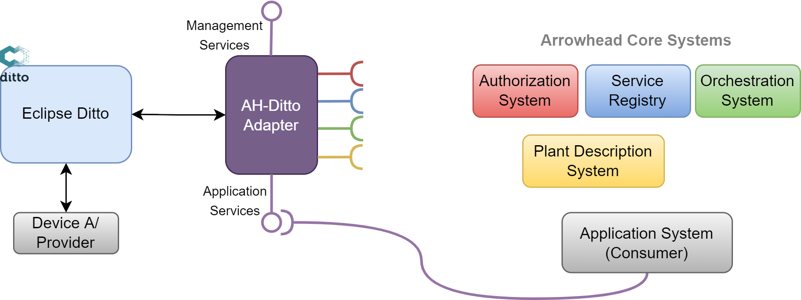
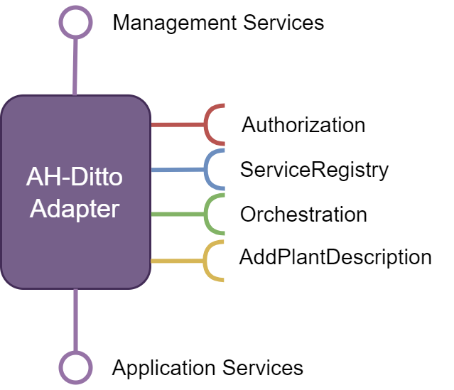

# AH-Ditto Adapter HTTP/TLS/JSON - System Description (SysD)

## Abstract
This document describes an adapter system useful for managing digital twins of application systems in the arrowhead framework by integrating the Eclipse Ditto framework with Eclipse Arrowhead. The objective is to support virtual representations to front physical application systems and provide their services. The term digital twin as a proxy (DTaaP) is used which provides benefits such as energy efficiency, availability & persistence, and security.

## Overview

This document describes the HTTP/TLS/JSON AH-Ditto Adapter system of Eclipse Arrowhead, which exists to help enable digital twin as a proxy (DTaaP) by integration Eclipse Ditto and Eclipse Arrowhead frameworks. The objective of DTaaP is to support virtual representations to front physical devices and provide their services. Benefits of having a digital proxy that provide services on behalf of a device include:

+ Energy efficiency
    + Devices can sleep (duty cycle) while digital proxy services are available
+ Availability & persistence
    + Digital proxy provides seamless persistency to service consumers. Physical device can be replaced
+ Security
    + Devices not capable of strong security interacts only with their digital proxy, while the digital proxy registers services and provides strong security to consumers

Setting up a digital proxy is optional and should be done when beneficial, i.e., there will be other devices that represent themselves without using digital proxy. Nevertheless, digital twin as a proxy can be used to integrate both Arrowhead compliant devices and those that are not arrowhead compliant.

## System Role
As already mentioned in Section 1, the AH-Ditto adapter system fulfils a primary role of integrating Eclipse Ditto with Eclipse Arrowhead framework. AH-Ditto Adapter is a temporary name for Eclipse Arrowhead compliant adapter around the Eclipse Ditto microservices that are to be incorporated in Eclipse Arrowhead framework.

 *Figure-1. Eclipse Arrowhead & Eclipse Ditto frameworks integrated with AH-Ditto Adapter System*

Figure 1 shows the setup of AH-Ditto Adapter system. To provide benefits of DTaaP in the Eclipse Arrowhead framework, AH-Ditto provides all the essential services of Eclipse Ditto compliance with Eclipse Arrowhead framework.
## Services

The AH-Ditto adapter system produces and consumes the following services as described in Figure 2.

 *Figure-2. AH-Ditto Adapter System Services*

The AH-Ditto consumes the following [HTTP]/[JSON] services:
+ Authorization
    + This service is consumed to authorize the consumer.
+ Service Registry
    + This service is consumed to make sure that the application services of every digital twin become accessible to other systems.
+ Orchestration
    + This service is used to determine what services to utilize.
+ Add Plant Description
    + This service is used to add a plant description to the PDE.

    
  

[HTTP]:https://doi.org/10.17487/RFC7230
[JSON]:https://doi.org/10.17487/RFC7159

