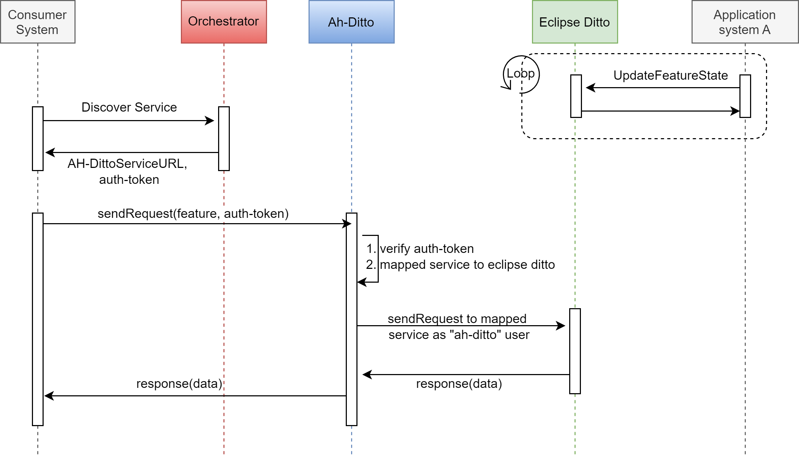

# AH-Ditto Adapter - System of Systems Description (SosD)

## Abstract
This document describes how a system of systems that includes a AH-Ditto interacts with the Digital Twin of an application system.

## Overview

This document describes how a system of systems that includes Ah-Ditto Arrowhead Framework adapter system interacts with digital twin by integrating Eclipse Ditto.

A System of Systems / Local cloud is assumed to include the following systems:
 - Eclipse Ditto
 - Service Registry
 - Authorization
 - Orchestrator
 - [Plant Description Engine]
 - AH-Ditto Adapter System
 - Some Producer systems
 - Some Consumer systems

We will as an example consider a local cloud that has the four core systems and two application systems:
 - A that produces service X
 - A that produces service Y
 - B that consumes service X, Y

Application system A is duty cycling battery driven device that cannot provide the services round the clock.


## AH-Ditto enabling the Digital Twin - Example System
The basic ArrowHead core systems are connected to each other and the AH-Ditto is also connected with the Eclipse Arrowhead and Eclipse Ditto.

There is an application provider system A in eclipse arrowhead local cloud. The application system A have two features X and Y. This application system device is duty cycling battery driven device and provide two services against each of it's features. It is hard to provide the services round the clock by this provider system. We can achieve by digital twin as a service (DTaaP) model.

Therefore we can create a digital twin of this application system A via AH-Ditto. The model of that digital twin will look like this:
```json
{
    "thingId": "my.namespace:device-a",
    "policyId": "my.namespace:policy-a",
    "attributes": {
        "name": "name"
    },
    "features": {
        "featureX": "valueX",
        "featureY": "valueY"
    }
}
```

When we create a digital twin in eclipse ditto via AH-Ditto, AH-Ditto expose and register the services against all the features of that digital twin in the eclipse arrowhead framework e.g, `featureX` and `featureY`. These services will then accessible through arrowhead local cloud.

Once the digital twin of application system A is created in eclipse ditto then we need to make connection between the actual application system A with its digital twin in side eclipse ditto. We can make connection by consuming a service of AH-Ditto to create conenction.

### Digital Twin In Action
Once digital twin is created and connected with its application system, the application system start sending it's state data to it digital twin dwin. Whenever any consumer system require some data from application system A, it can get it from it's digital twin by meeting the security requirements. The complete flow of interaction is as follow.


 *Figure-1. Digital twin interaction with consumer systems via AH-Ditto Adapter System*