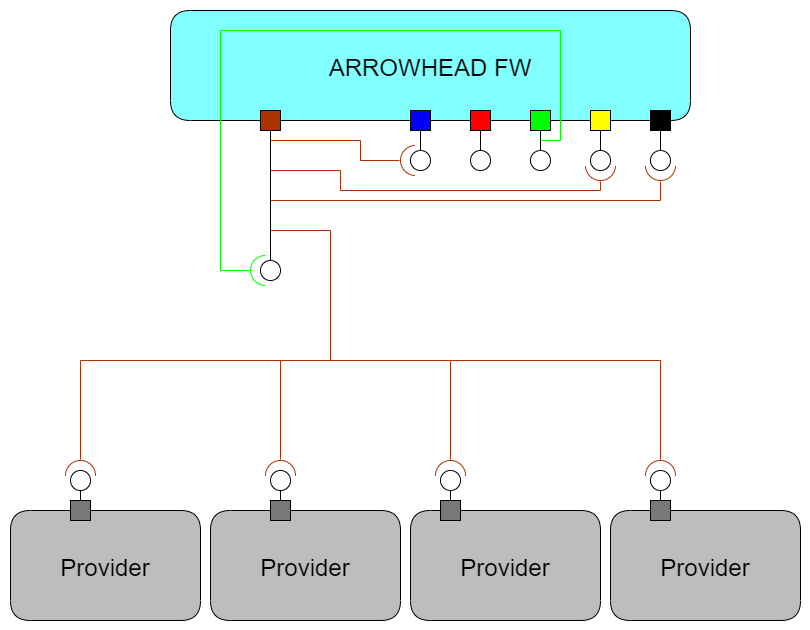
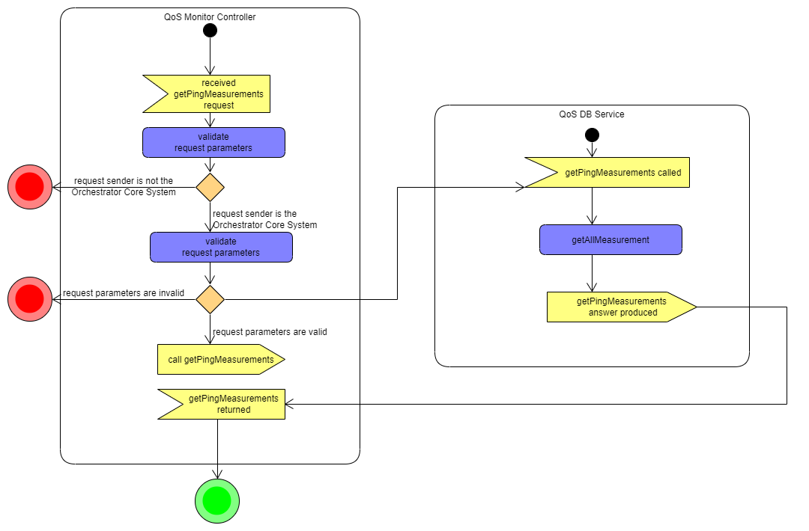
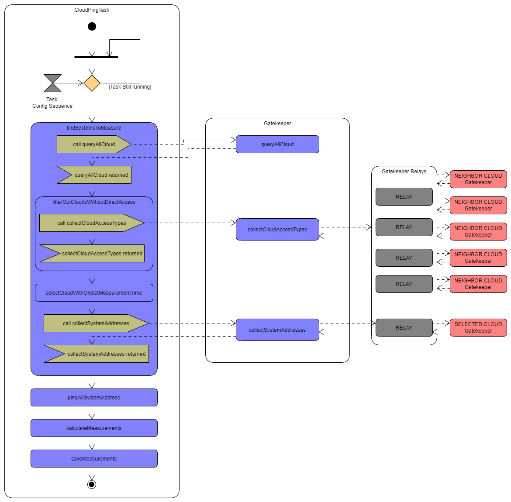
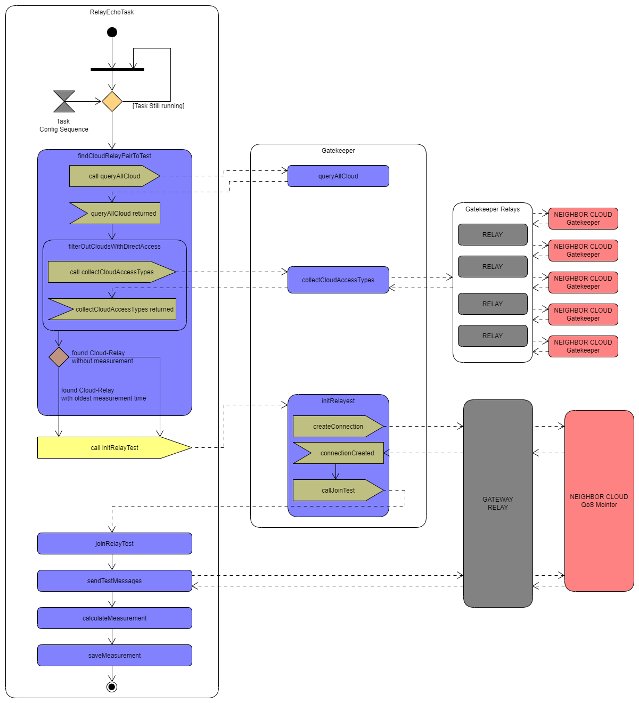

### QUALITY OF SERVICE MONITOR  System Design Description

---

The purpose of QoS Monitor supporting core system is providing QoS (Quality of Service) measurements to the QoS Manager (which is part of the Orchestrator core system).

 `AH Service Registry`
 `AH Authorization` 
 `AH Orchestrator / QoS Manager`

 `AH Gatekeeper`
 `AH Gateway`
 `AH QoS Monitor`

# Services and Use Cases
## Provided Services

The QoS Monitor provides the following services:

_Client:_

* [Echo](#echo_service_use_case)

_Private:_

* [Public Key](#public_key_service_use_case)
* [Intra-Cloud Ping Measurement](#intra_ping_service_use_case)
* [Intra-Cloud Ping Median Measurement](#intra_ping_median_service_use_case)
* [Inter-Cloud Direct Ping Measurement](#inter_direct_ping_service_use_case)
* [Inter-Cloud Relay Echo Measurement](#inter_relay_echo_service_use_case)
* [Init Relay Test](#init_relay_test_service_use_case)
* [Join Relay Test](#join_relay_test_service_use_case)

## Consumed Services

_Service Registry Core System:_

* Query

_Gatekeeper Core System:_

* Pull Clouds
* Get Cloud
* Collect Access Types
* Collect System Addresses
* Relay Test

---

### Use Case: Echo Service <a name="echo_service_use_case" />

| Name | Description |
| ---- | --------- |
| Brief Description | Returns a short message if the system is alive. |
| Access Control | All system within the local cloud are allowed to access |
| Primary Actors | QoS Monitor |
| Preconditions | - |
|Main Flow| * Request sent by client.  * Request procced and response sent by QoS Monitor. |

### Use Case: Public Key Service <a name="public_key_service_use_case" />

| Name | Description |
| ---- | --------- |
| Brief Description | Returns the Public Key of QoSMointor Core System as a Base64 encoded text. |
| Access Control | All system within the local cloud are allowed to access |
| Primary Actors | QoS Monitor |
| Preconditions | - |
|Main Flow| * Request sent by an allowed core system.  * Request procced and response sent by QoS Monitor. |

### Use Case: Intra-Cloud Ping Measurement Service <a name="intra_ping_service_use_case" />

| Name | Description |
| ---- | --------- |
| Brief Description | Returns the ping related values measured by a scheduled task for systems within the local cloud. |
| Access Control | Only Orchestrator and Gatekeeper Core Systems are allowed to access |
| Primary Actors | QoS Monitor |
| Secondary Actors | Service Registry |
| Preconditions | Service Registry has to be availble. |
| Main Flow | * Intra-Cloud Ping Measurement Task scheduled  * Task queries Service Reqistry for systems and select one to be measured  * Stored or immediate measurement details are provided upon request  |

_Activity diagram: Intra-Cloud Ping Measurement Service:_

_Activity diagram: Intra-Cloud Ping Measurement Task:_

### Use Case: Intra-Cloud Ping Median Measurement Service <a name="intra_ping_median_service_use_case" />

| Name | Description |
| ---- | --------- |
| Brief Description | Calculates and returns the median ping related values based on the given attribute. |
| Access Control | Only Orchestrator and Gatekeeper Core Systems are allowed to access |
| Primary Actors | QoS Monitor |
| Secondary Actors | - |
| Preconditions | - |
| Main Flow | * Request sent by an allowed core system  * Calculation performed and response sent by QoS Monitor. |

### Use Case: Inter-Cloud Direct Ping Measurement Service <a name="inter_direct_ping_service_use_case" />

| Name | Description |
| ---- | --------- |
| Brief Description | Returns the ping related values measured by a scheduled task for systems located within a neighbor cloud accessible without Gateway Core System. |
| Access Control | Only Orchestrator and Gatekeeper Core Systems are allowed to access |
| Primary Actors | QoS Monitor |
| Secondary Actors |Gatekeeper |
| Preconditions | Gatekeeper has to be available. |
| Main Flow | * Inter-Cloud Direct Ping Measurement Task scheduled  * Task queries Gatekeeper for clouds with direct access and select one to measure its systems  * Stored measurement details are provided upon request  |

_Activity diagram: Inter-Cloud Direct Ping Measurement Task:_

### Use Case: Inter-Cloud Relay Echo Measurement Service <a name="inter_relay_echo_service_use_case" />

| Name | Description |
| ---- | --------- |
| Brief Description | Returns the measurement values processed by a scheduled task for neighbor clouds accessible only via Gateway Core System. |
| Access Control | Only Orchestrator and Gatekeeper Core Systems are allowed to access |
| Primary Actors | QoS Monitor in both cloud |
| Secondary Actors | Gatekeeper, Relay |
| Preconditions | Gatekeeper and Relay(s) has to be available. |
| Main Flow | * Inter-Cloud Relay Echo Measurement Task scheduled  * Task queries Gatekeeper for clouds without direct access and select one to measure it  * Stored measurement details are provided upon request  |

_Activity diagram: Inter-Cloud Relay Echo Measurement Task:_

### Use Case: Init Relay Test Service <a name="init_relay_test_service_use_case" />

| Name | Description |
| ---- | --------- |
| Brief Description | Launch an inter-cloud relay echo test session for the given cloud and via the given relay. |
| Access Control | Only Gatekeeper Core Systems are allowed to access |
| Primary Actors | QoS Monitor in both cloud |
| Secondary Actors | Gatekeeper in both cloud, Relay(s) |
| Preconditions | Gatekeepers and Relay(s) has to be available. |
| Main Flow | * Inter-Cloud Relay Echo Measurement Task selects a cloud-relay pair  * Task instruct the local cloud's Gatekeeper to negotiate the creation of test session  * QoS Monitor creates message queues based on the negotiation for testing the connection between local cloud and target cloud through the given relay |

### Use Case: Join Relay Test Service <a name="join_relay_test_service_use_case" />

| Name | Description |
| ---- | --------- |
| Brief Description | Join to an inter-cloud relay echo test session requested by an other cloud. |
| Access Control | Only Gatekeeper Core Systems are allowed to access |
| Primary Actors | QoS Monitor in both cloud |
| Secondary Actors | Gatekeeper in both cloud, Relay(s) |
| Preconditions | Gatekeepers and Relay(s) has to be available. |
| Main Flow | * Gatekeeper receives a test session negotiation message via relay from the requester cloud's Gatekeeper   * Requested cloud's Gatekeeper insturcts QoS Monitor to create message queues for the relay being measured  * Requested cloud's QoS Monitor returns the test session information to the Gatekeeper which forwards it to the requester cloud's Gatekeeper |
